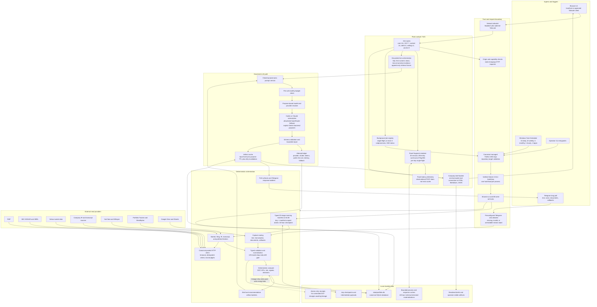
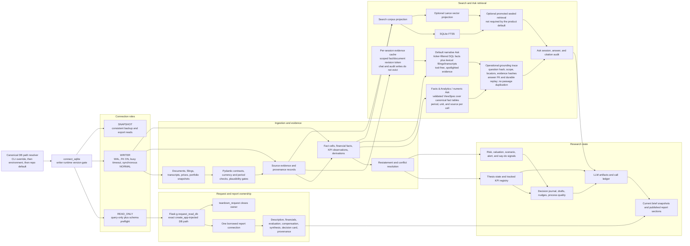
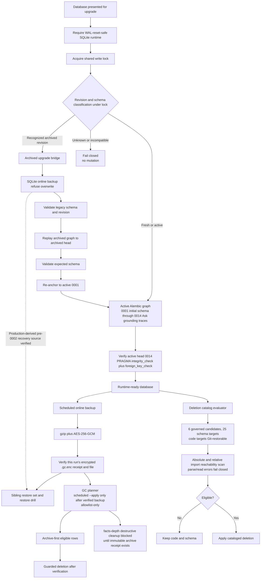

# Backend and database flows

This map describes the localhost application after the August 2026 debt-hardening pass. It groups the 154 Flask routes by responsibility while preserving the distinct ingress, managed-runtime, orchestration, persistence, cache, and external-provider boundaries.

## Runtime and backend flow

## Database access, lineage, and publication flow

## Schema upgrade, backup, retention, and deletion flow

## Operational boundaries

- The application is single-user and localhost/Tailscale-scoped; it is not a public multi-tenant service.
- Live scheduler registration, optional provider credentials, and real production population are operational checks, not implied by source-level green tests.
- The production-derived pre-`0002` backup has passed integrity, foreign-key, bridge, and deleted-plane recovery verification; Git still restores code rather than database rows.
- The dormant legacy Gemini fallback compatibility exports are outside the canonical production route and remain one low-priority cleanup item pending an external-import compatibility scan.
