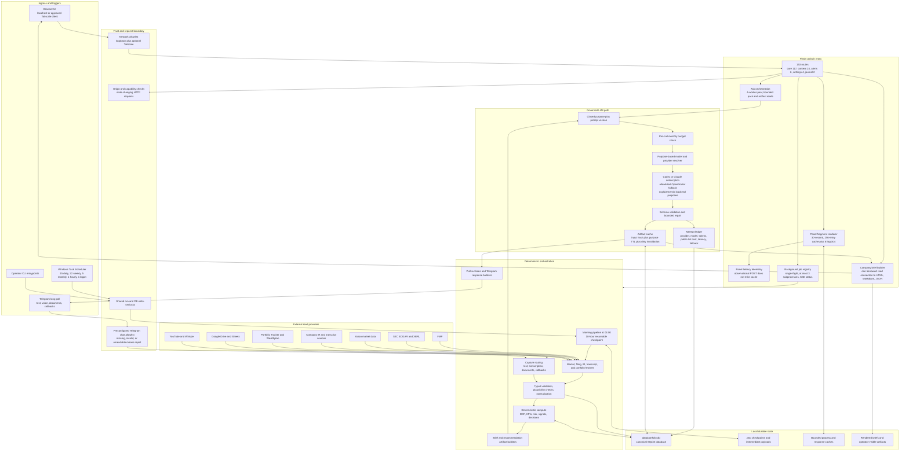
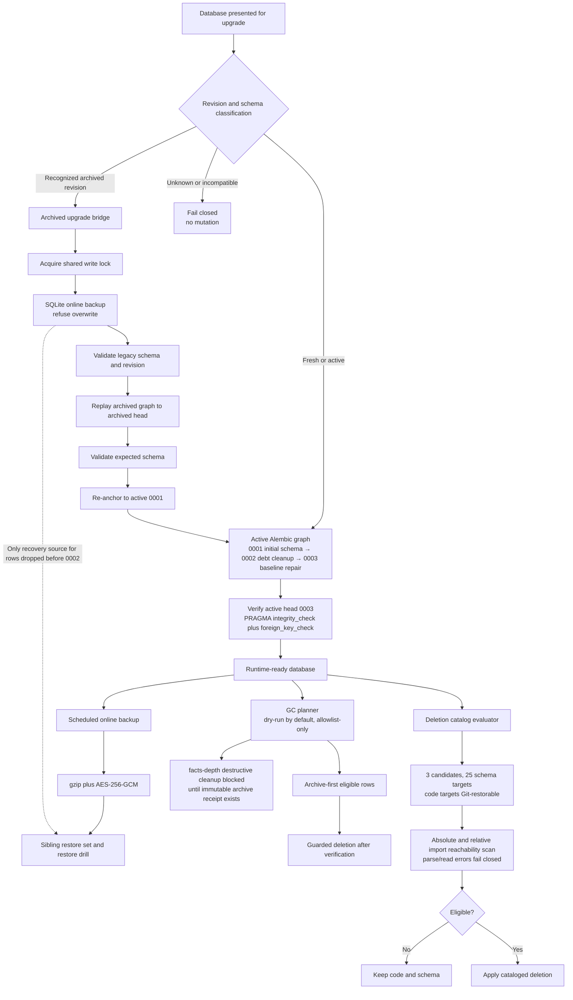

# Backend and database flows

This map describes the localhost application after the August 2026 debt-hardening pass. It groups the 153 Flask routes by responsibility while preserving the distinct ingress, orchestration, persistence, cache, and external-provider boundaries.

## Runtime and backend flow

## Database access, lineage, and publication flow

```mermaid
flowchart LR
    path["Canonical DB path resolver"] --> runtime["connect_sqlite"]
    subgraph roles["Connection roles"]
        ro["READ_ONLY\nquery-only plus schema preflight"]
        writer["WRITER\nWAL, FK ON, busy timeout, synchronous NORMAL"]
        snapshot["SNAPSHOT\nconsistent backup and export reads"]
    end
    runtime --> ro
    runtime --> writer
    runtime --> snapshot
    subgraph request["Request and report ownership"]
        flask_g["Flask g.request_read_db"]
        teardown["teardown_request closes owner"]
        report_conn["One borrowed report connection"]
        sections["Description, financials, evaluation, compensation, synthesis, decision card, provenance"]
    end
    ro --> flask_g --> report_conn --> sections
    flask_g --> teardown
    subgraph ingestion["Ingestion and evidence"]
        raw["Documents, filings, transcripts, prices, portfolio snapshots"]
        validate["Pydantic contracts, currency and period checks, plausibility gates"]
        evidence["Source evidence and provenance records"]
        facts["Fact cells, financial facts, KPI observations, derivations"]
        resolution["Restatement and conflict resolution"]
    end
    raw --> validate --> evidence --> facts --> resolution
    writer --> raw
    writer --> evidence
    writer --> facts
    subgraph research["Research state"]
        thesis["Thesis state and tracked KPI registry"]
        decisions["Decision journal, drafts, nudges, process quality"]
        signals["Risk, valuation, scenario, alert, and say-do signals"]
        artifacts["LLM artifacts and call ledger"]
        publication["Current brief snapshots and published report sections"]
    end
    resolution --> thesis
    resolution --> signals
    thesis --> decisions
    signals --> decisions
    thesis --> artifacts
    decisions --> artifacts
    artifacts --> publication
    sections --> publication
    subgraph retrieval["Search and Ask retrieval"]
        corpus["Search corpus projection"]
        fts["SQLite FTS5"]
        vectors["Optional Lance vector projection"]
        sealed["Sealed retrieval pack with citations"]
        audit["Ask session, answer, and citation audit"]
    end
    evidence --> corpus
    facts --> corpus
    corpus --> fts
    corpus --> vectors
    fts --> sealed
    vectors --> sealed
    sealed --> audit
    audit --> artifacts
```

## Schema upgrade, backup, retention, and deletion flow

## Operational boundaries

- The application is single-user and localhost/Tailscale-scoped; it is not a public multi-tenant service.
- Live scheduler registration, optional provider credentials, and real production population are operational checks, not implied by source-level green tests.
- Rows removed before migration `0002` are recoverable only from a pre-`0002` database backup. Git restores code, not deleted database rows.
- The dormant legacy Gemini fallback compatibility exports are outside the canonical production route and remain one low-priority cleanup item pending an external-import compatibility scan.
