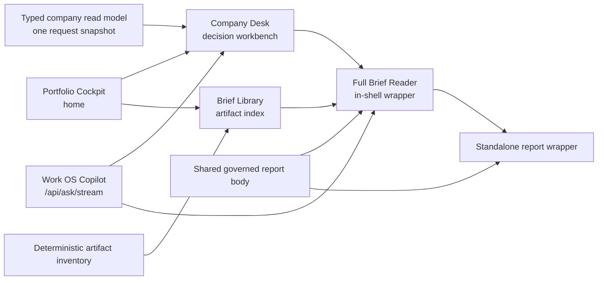

# Company Research Experience Productionization PRD

**Status:** Implemented on `origin/main` through PRs #1208–#1212; retained as a historical decision record
**Date:** 2026-08-10
**Scope:** Company Desk, Brief Library, Full Research Brief reader, and removal of the research UI/backend paths they supersede
**Approved visual and interaction reference:** `mockups/company_research_experience.html`
**Out of scope:** Replacing Portfolio Cockpit as the Work OS home page

## 0. Implementation record

This PRD was written against the pre-implementation checkout at `9a00e560`. It
is no longer an inventory of current production code. The implementation was
landed from a clean `origin/main` baseline in five small PRs and verified here
against `origin/main` at `2632deea` on 2026-08-10:

| Change | Landed outcome |
|---|---|
| Durable Copilot approval and recovery contracts | PR #1208 |
| One Copilot runtime; retired legacy chat session implementation | PR #1209 |
| Company Desk, Brief Library, subordinate Full Brief reader, artifact index, reader boundary, and legacy shell cleanup | PR #1210 |
| Neutral Full Brief thesis and change ledes, extracted from the stale checkout onto current main | PR #1211 |
| Unreachable Ledger-specific streaming transport and per-card chat state | Deleted in PR #1212 |
| Legacy `command_center_shell.py`, `ask_dock.py`, duplicate Cockpit warmup/polling tests, and scheduled session distillation | Deleted in PR #1210 |
| Legacy `chat_session.py` and buffered Ask implementation | Deleted in PR #1209; `/api/ask/stream` remains the research conversation path |

Sections 3, 10, 12, 16, and 17 are retained to explain the planning baseline
and implementation rationale. They must not be used as evidence that deleted
modules or routes still exist. Current source, route tests, and Git history are
authoritative.

One production-data acceptance gap remains: the live service is healthy, but
Brief Library currently reports no indexed persisted artifacts. The artifact
index and reconciliation code exist, but deep-link and real persisted-reader
acceptance are not proven until the live inventory is reconciled and a complete
on-disk brief opens through Desk and Library.

## 1. Executive summary

At the planning baseline, the approved company-research mockup was not reflected in the production application. Production still used the existing Work OS shell, generated a smaller ad hoc Company Desk, and opened the old persisted workspace report inside an iframe. The resulting Company Desk and Full Research Brief did not reproduce the approved hierarchy, density, editorial reader, Brief Library, contextual actions, or shared research design language.

The project productionized the approved research experience inside the existing Work OS. Portfolio Cockpit remains the home page. The existing L1 portfolio experience remains intact. The mockup governs only:

1. Company Desk — the decision-oriented operating surface for one company.
2. Brief Library — the persistent index of research artifacts.
3. Full Research Brief — a subordinate editorial reader opened from Company Desk or Brief Library.

The implementation was intentionally aggressive about deleting presentation code, duplicate LLM entry points, polling, eager loading, compatibility layers, and endpoints that the approved flow replaced. It preserved provenance, freshness, stable identities, human approval, append-only history, and deterministic page rendering.

No LLM may execute merely because Cockpit, Company Desk, Brief Library, or Full Brief is opened. LLM work requires an explicit user action or remains in an existing scheduled artifact pipeline whose output is actually consumed by the approved experience.

## 2. Product decisions that are not open for reconsideration

### 2.1 Portfolio Cockpit remains home

`/` continues to open Portfolio Cockpit. The company-research mockup is not a replacement shell and must not become the application home page. Its sidebar and top bar are scaffolding used to demonstrate the research flow.

The production Work OS retains its three-layer navigation:

- **L1 — Portfolio Intelligence:** Portfolio Cockpit, Performance vs Index, Risk & Allocations.
- **L2 — Research Engine:** Company Desk, Brief Library, Analytics Playground.
- **L3 — Operations & Governance:** Decision Audit Log, Execution Queue & Operations.

Full Research Brief is reader state, not a persistent sidebar destination.

### 2.2 The approved mockup owns the research experience

`mockups/company_research_experience.html` is the approved structural and interaction reference for Company Desk, Brief Library, and Full Brief. Production must preserve its intended hierarchy, density, spacing, reader/workbench distinction, contextual Chat/Edit affordances, and transitions between these three modes.

The mockup's static sample values are illustrative, not a data contract. Production values must come from governed project state and visibly disclose missing, stale, degraded, or conflicting inputs.

### 2.3 Company Desk and Full Brief have different jobs

- **Company Desk** answers: What is the current posture, what changed, what is closest to breaking, what research remains open, and what event could change the action?
- **Full Brief** contains the complete argument, company and moat analysis, financial history, quarter and guidance detail, thesis and risk evidence, valuation and comps, source inventory, citations, and appendices.

Company Desk must not embed the Full Brief as its primary content. Full Brief must not look like another dashboard.

### 2.4 One conversational surface

Work OS Copilot and `POST /api/ask/stream` become the sole production research conversation surface. Company Desk cards, Full Brief sections, Analytics, and any surviving panels delegate to that surface with typed context.

No separate Ask dock, report chat stack, panel-specific chat runtime, or buffered Ask UI should remain after migration.

## 3. Current-state problem

> Historical planning snapshot: the conditions below describe `9a00e560`
> before PRs #1208–#1210. On current main, Company Research consumes dedicated
> Work OS adapters, Full Brief is subordinate reader state, the legacy shell
> and Ask dock are deleted, and Copilot uses the streaming Ask path. The live
> artifact inventory gap recorded in Section 0 is the remaining acceptance risk.

### 3.1 Production does not consume the approved mockup

The production root is rendered by `src/pipeline/work_os_shell.py`, which reads `mockups/harvey_sidebar_flow.html` and transforms it with string and regular-expression substitutions. `mockups/company_research_experience.html` is covered by prototype tests but is not used by production.

This creates two sources of front-end truth:

- the approved company-research experience; and
- the older prototype transformed into the live Work OS.

The transformed-prototype approach also constructs demo behaviors and then removes or replaces them at render time. This is difficult to reason about, produces dead source, and makes deletion and accessibility verification unnecessarily fragile.

### 3.2 Production Company Desk is an approximation

The current `workOsRenderCompanyDesk*` implementation creates a compact decision card, a summary of pending items, decision drivers, and a research queue. It does not reproduce the approved Company Desk structure or all of its intended interactive relationships.

Its typed adapter constructs broad legacy models—Ticker Command Center, Holding Rail, and a full Thesis section—through multiple database and filesystem reads, then discards much of their output. Stable decision, KPI, alert, condition, source, and revision identities are frequently lost before rendering.

The current portfolio hydration also eagerly invokes Company Desk rendering even when the user remains on Portfolio Cockpit. This causes unnecessary database and filesystem work during home-page load.

### 3.3 Production Full Brief does not reflect the approved format

The approved mockup presents Full Brief as an editorial reading canvas with restrained hierarchy, a document measure, compact key figures, a section table of contents, contextual sources, comments, and one shared Ask action.

Production instead opens `/reports/<ticker>` in an iframe. That route serves the latest dated `*_workspace.html` artifact. Existing artifacts retain the markup and JavaScript generated at build time; the current delivery layer only replaces the first CSS block.

Consequences:

- Full Brief retains the older report design language and feels disconnected from Work OS.
- Embedded report chrome and Work OS chrome overlap conceptually.
- Persisted report JavaScript can outlive its backend routes.
- Existing reports still contain legacy `/chat/<ticker>` calls while the current backend returns 410 for those routes.
- Updating renderer source does not update already-generated artifacts.
- The current on-disk NU brief predates newer dirty KPI configuration and must not be treated as a clean freshness baseline.

The production reader must display the complete real brief on disk, not only the abbreviated example sections shown in the mockup.

### 3.4 Duplicate and stranded LLM paths remain

The repository currently contains or recently contained multiple research conversation clients:

- Work OS Copilot using `/api/ask/stream`.
- buffered `/api/ask` UI behavior.
- `pipeline/ask_dock.py` mounted by the retired command-center shell.
- report-local `/chat/<ticker>` and `/chat/<ticker>/apply` behavior.
- Explore- and Ledger-specific Ask runtimes.
- explicit and scheduled session-distillation paths.

These increase code size, context requirements, latency risk, and the number of mutation boundaries that must be audited. The approved experience needs one Copilot, not multiple chat products.

## 4. Goals

1. Productionize the approved Company Desk, Brief Library, and Full Brief experience inside the existing Work OS.
2. Preserve Portfolio Cockpit as the home page and avoid regressions to L1 portfolio workflows.
3. Render Company Desk from a narrow, typed, request-scoped read model.
4. Render Full Brief through one shared content renderer with standalone and in-shell wrappers.
5. Make Brief Library the persistent L2 destination that replaces Full Research Brief in the rail.
6. Preserve exact provenance, freshness, coverage gaps, stable identities, revisions, and owner/model distinctions.
7. Collapse all research conversation affordances onto Work OS Copilot streaming.
8. Eliminate render-time LLM calls, eager Company Desk loading, obsolete polling, and redundant boot warmup.
9. Delete replaced presentation code and compatibility layers as soon as their consumers have migrated.
10. Leave the codebase with fewer UI owners, fewer runtime transformations, and one source of truth for each state value.

## 5. Non-goals

1. Redesigning Portfolio Cockpit, Performance, Risk & Allocations, Analytics, Decision Audit, or Execution Queue merely because they are absent from the company-research mockup.
2. Replacing deterministic research stores, scheduled ingestion, report section builders, comments, fact provenance, or decision-condition engines that remain useful to the approved surfaces.
3. Hydrating mockup sample values as production facts.
4. Adding a new generic service layer, storage axis, or second report database.
5. Running LLM generation during page render to fill missing Company Desk or Full Brief fields.
6. Allowing Chat or Edit controls to imply a safe mutation path where none exists.
7. Preserving obsolete endpoints solely because old tests assert their strings.

## 6. Target experience

### 6.1 Portfolio Cockpit

Cockpit remains the initial screen and retains its existing product role. It must not load Company Desk data until the user enters Company Desk or follows a ticker-specific research link.

The implementation may consolidate duplicate Cockpit endpoints and polling, but must first preserve the exact useful home-page read model behind one canonical endpoint.

### 6.2 Company Desk

Company Desk is a dense decision workbench. It should expose the approved hierarchy using governed data:

- company identity, coverage role, position status, and portfolio allocation;
- one dominant current posture with owner/model provenance;
- current price, fair value reference, nearest catalyst, and latest decision date at secondary scale;
- pre-earnings and post-earnings artifact links;
- direct Google Sheet DCF link;
- decision-relevant changes since the user's last read;
- strongest new disconfirming evidence;
- threshold-linked thesis contracts and decision KPIs;
- open questions and research tangents;
- catalysts tied to action rules;
- latest brief metadata and one primary reader action;
- contextual Chat and Edit actions where the capability contract permits them.

Evidence and freshness belong beside the claims they qualify. Detached metadata bands should not duplicate information already available through exact source doorways.

### 6.3 Brief Library

Brief Library becomes the persistent L2 destination currently occupied by Full Research Brief. It indexes existing artifacts without rebuilding them.

Required filters and metadata:

- holdings, evaluations, pre-earnings, post-earnings, and other approved artifact kinds;
- ticker, title, artifact kind, coverage role, report date, version or build identity;
- current, stale, update-due, archived, or degraded status;
- source count, comment count, and known coverage gaps where available;
- deterministic link to the reader or appropriate artifact view.

Library load must be LLM-free and must not walk or rebuild the full report corpus on every request. Use a compact deterministic artifact inventory or indexed projection.

### 6.4 Full Research Brief reader

Full Brief is opened from Company Desk or Brief Library. The in-shell reader follows the approved editorial design while displaying every applicable section from the real report.

The reader should group the complete production report into the existing research families:

1. Overview & Moat.
2. Quarter & Guidance.
3. Financials & DCF.
4. Thesis & Risk.
5. Valuation & Comps.
6. Sources & Citations.

Historical financial tables, segment analysis, earnings detail, say/do history, IR summaries, recent developments, bear cases, transcripts, comments, and provenance remain available in the reader where present in the artifact.

The reader should use rules, measure, spacing, and typographic hierarchy rather than pervasive dashboard cards. It must share the current Work OS design tokens and controls without acquiring the visual weight of another application shell.

## 7. Target architecture



### 7.1 Front-end ownership

- Existing Work OS owns global chrome, home routing, navigation, overlays, focus behavior, and responsive shell.
- A dedicated research-experience renderer owns Company Desk, Brief Library, and in-shell reader composition.
- Shared `src/ui/tokens.py` and `src/ui/controls.py` own visual primitives.
- The approved mockup supplies layout and interaction intent, not a second component library.

### 7.2 Report ownership

Refactor the report renderer around a shared governed body:

- `render_report_body(spec)` or an equivalent deep interface owns sections and report content.
- the standalone wrapper owns `/reports/<ticker>` document chrome;
- the in-shell wrapper owns reader integration with Work OS;
- both use the same section content, provenance, comments, interaction bundle, and current styles.

Do not solve this by parsing an iframe's rendered HTML at runtime. Do not maintain separate full-report implementations for standalone and embedded modes.

### 7.3 Company Desk ownership

Replace the broad adapter with one typed read model opened through one request-scoped database connection. Add only the required filesystem artifact metadata after the consistent database snapshot.

The response should include stable handles rather than copied prose alone:

- `decision_id`, owner/model classification, revision, and decision time;
- `condition_id` and current evaluation for thresholds;
- `kpi_definition_id`, `fact_ref`, period, unit, current status, and source IDs;
- `note_id`, revision or updated-at precondition, kind, body, and owner/due metadata;
- `alert_id`, evidence references, status, and queued action where relevant;
- catalyst/event identity, date, source, linked action rule, and status;
- report identity, report date, modified time, source count, comments, and coverage state;
- portfolio allocation with tracker `as_of`, degraded state, and warnings.

## 8. Interaction and mutation contract

Every interactive research control carries a stable capability envelope:

```json
{
  "capability_id": "research.open_questions.edit",
  "ticker": "NU",
  "surface": "company_desk",
  "entity_type": "analyst_note",
  "entity_id": "123",
  "revision": "current-revision-or-checksum",
  "fact_refs": [],
  "source_ids": [],
  "intent": "edit"
}
```

Required behavior:

- Chat is read-only and opens global Copilot with exact visible context.
- Chat does not silently resolve notes, ratify decisions, or apply report edits.
- Edit first loads current state and displays a deterministic form or diff.
- Writes fail closed on stale revision or checksum.
- Human approval is explicit.
- Persistence goes through the module that owns validation and audit.
- Successful mutations produce an idempotent receipt and append-only history.
- LLM drafting, when offered, is a separate explicit action inside the proposal flow.

Open-question supersede may reuse the existing analyst-note lifecycle after adding an expected-revision guard. Thesis-contract edits require a deterministic preview/approve path owned by the decision-condition module. Direct UI writes to `decisions.decision_conditions` are forbidden.

## 9. LLM and latency policy

### 9.1 Page-load rule

The following must be deterministic and LLM-free:

- Cockpit load.
- Company Desk load and company switching.
- Brief Library load and filtering.
- Full Brief load and section navigation.
- Evidence and source drawers.
- Editing current structured state before the user requests drafting.

### 9.2 One explicit conversational path

Keep:

- Work OS Copilot.
- `/api/ask/stream`.
- durable sessions, typed research context, revisioned proposals, and approval receipts.

Current-main disposition:

- `pipeline/ask_dock.py` and buffered `/api/ask` are deleted.
- report-local `/chat/<ticker>` and `/chat/<ticker>/apply` are bounded 410
  tombstones, not conversation runtimes.
- Explore delegates to `openWorkOsCopilot()`.
- Ledger delegates to `openWorkOsCopilot()`; its unreachable legacy streaming
  block and per-card chat state were deleted in #1212.
- the shell no longer constructs and strips demo Copilot behavior.

### 9.3 Scheduled and on-demand generation

- Preserve scheduled LLM pipelines only when they produce governed artifacts consumed by Company Desk, Brief Library, Full Brief, Cockpit, or another approved product surface.
- Delete HTTP generation controls that existed only in removed panels. Preserve a CLI or scheduled producer when it has an active non-UI consumer.
- Disable scheduled Ask-session distillation by default while there are no meaningful sessions or adopted outputs. Retain a temporary manual owner-triggered path only if Interaction Review exposes useful results.
- Do not weaken provenance or evidence generation merely to reduce UI code.

### 9.4 Performance expectations

- Cockpit must not trigger Company Desk construction.
- Company Desk switching should use one narrow request, not several broad builders.
- Brief Library should read an indexed inventory, not rebuild reports.
- Report rendering may read persisted governed content but must never invoke a new LLM call.
- Lazy-load secondary tabs, comments, large tables, and source detail.
- Remove obsolete 90-second polling and duplicate 35–40-second boot warmup after Cockpit is consolidated onto one canonical read path.

## 10. Cleanup and deprecation matrix

This is the original target matrix. Rows marked landed below were verified on
`origin/main` at `2632deea`; the other rows remain rationale or residual
compatibility policy, not proof of a current consumer.

| Surface or module | Target disposition | Prerequisite |
|---|---|---|
| Existing Portfolio Cockpit product behavior | **Keep** | Consolidate its useful reads behind one canonical endpoint. |
| `workOsRenderCompanyDesk*` ad hoc markup | **Replaced in #1210** | Dedicated Company Desk renderer is live. |
| `screen-full-brief` primary navigation | **Replaced in #1210** with Brief Library | Old screen identity aliases to Library. |
| iframe-based Full Brief canvas | **Replaced in #1210** | Shared report body and in-shell wrapper are live. |
| `command_center_shell.render_shell` | **Deleted in #1210** | Useful Cockpit/Overview reads were extracted first. |
| `pipeline/ask_dock.py` | **Deleted in #1210** | All Chat actions use Work OS Copilot. |
| buffered `/api/ask` | **Deleted in #1209** | Streaming `/api/ask/stream` is canonical. |
| report `/chat/<ticker>` GET | **410 tombstone temporarily** | Response identifies the Work OS Copilot replacement; delete after artifact migration and zero activation. |
| report chat POST/apply | **410 tombstone temporarily** | Delete after artifact migration and zero activation. |
| Explore/Ledger Ask JavaScript | **Delete** | Delegate controls to `openWorkOsCopilot()`. |
| `/api/cockpit` and 90-second polling | **Deleted in #1210** | Canonical Cockpit endpoint proved parity. |
| `/api/panel/overview` | **Keep temporarily or rename** | Do not delete the Cockpit capability; choose one surviving contract. |
| boot warmup for duplicate Cockpit endpoints | **Deleted in #1210** | Startup coverage replaced the obsolete warmup tests. |
| scheduled session distillation | **Deleted in #1210** | Had no live Ask/raw/postmortem candidates or consumed product output. |
| `/api/panel/holding` and old holding HTML | **Delete or compatibility alias** | Company Desk, Discovery links, Notes, and deep links have migrated. |
| broad Ticker Command Center renderer | **Delete presentation half** | Extract narrow data owners still used elsewhere. |
| `ticker_command_center.py` as a whole | **Do not delete wholesale** | It contains live reads and compatibility behavior. |
| `chat_session.py` as a whole | **Deleted in #1209** | The PRD overreached: current Ask uses `src/ask/narrative_transport.py`; it no longer consumes this module. |
| report section builders and data stores | **Keep** | These supply the real Full Brief. |
| comments, evidence, fact/source, notes, conditions, approvals | **Keep and reconnect** | Expose stable identities and provenance in new contracts. |
| unused panel renderers | **Delete aggressively** | Confirm the approved Work OS has no remaining navigation, drawer, or composite consumer. |

## 11. Compatibility shortcuts

Prefer small redirects, aliases, or adapters over preserving obsolete screens:

- `/ticker/NU` → canonical Company Desk state with ticker `NU`.
- `#screen-full-brief` → Brief Library.
- old compatible GET path → new GET path.
- old report-chat GET → `/?copilot=1&ticker=NU&report_date=...`.
- parameterized legacy hashes must preserve the selected ticker.

Only alias routes whose response contracts match. JSON cannot be renamed to HTML without translation. Buffered JSON Ask cannot be redirected to SSE while old callers still expect JSON. Compatibility branches must emit a bounded structured activation event so they can be removed after a defined migration window.

## 12. Historical delivery sequence

This sequence is retained as the implementation plan that produced PRs
#1208–#1210. Phase completion in Git does not waive the live artifact and
deep-link acceptance gap recorded in Section 0.

### Phase 0 — establish a safe baseline

1. Recreate or rebase implementation work on current `origin/main` in an isolated worktree.
2. Preserve unrelated dirty changes, especially `micro_thesis/ir_config/NU.json` and local workbooks.
3. Confirm the production database schema and report artifact inventory through repository wrappers.
4. Pin the approved IA in tests: Cockpit home; Brief Library persistent; Full Brief transient.

### Phase 1 — research canvases

1. Stop eager Company Desk hydration from Cockpit.
2. Add Brief Library in the existing Full Brief navigation slot.
3. Productionize the approved Company Desk layout inside the existing shell.
4. Add honest loading, empty, stale, degraded, conflicting, and error states.
5. Add narrow typed Company Desk and Brief Library endpoints.

### Phase 2 — canonical reader

1. Extract the shared governed report body.
2. Build standalone and in-shell reader wrappers.
3. Apply the approved brief design language to the complete real report.
4. Preserve comments, citations, source doorways, keyboard behavior, and responsive reading.
5. Regenerate current report artifacts and verify representative historical behavior.

### Phase 3 — actions and governance

1. Route all Chat affordances to Work OS Copilot streaming.
2. Pass stable card, entity, fact, and source context into Ask retrieval.
3. Add optimistic concurrency to open-question supersede.
4. Add deterministic thesis-contract preview/approve through the condition owner.
5. Verify owner/model labeling and mutation receipts.

### Phase 4 — deletion

1. Remove old Ask dock, buffered Ask UI, iframe reader, report-local chat, and duplicated panel Chat runtimes.
2. Remove old command-center shell after extracting surviving Cockpit reads.
3. Remove duplicate Cockpit polling and warmup.
4. Remove old holding/report presentation renderers and unused panel routes.
5. Remove compatibility aliases after the bounded activation window.
6. Update README, report usage documentation, QA walkthroughs, and route inventories.

## 13. Acceptance criteria

### Product and navigation

- `/` opens Portfolio Cockpit.
- Normal Cockpit load does not request Company Desk data.
- The persistent L2 destinations are Company Desk, Brief Library, and Analytics Playground.
- Full Brief is opened from Desk or Library and has an accessible Back action.
- Old ticker deep links open the correct company without losing ticker context.

### Company Desk

- Production visually and structurally matches the approved Company Desk direction.
- Decision posture is the dominant text role; secondary values use the compact hierarchy.
- Allocation is shown as portfolio percentage with freshness and degraded-state metadata.
- Pre/post-earnings and Google Sheet DCF links are deterministic.
- Changes, KPIs, questions, catalysts, alerts, and sources preserve stable identities and provenance.
- No Company Desk page load invokes an LLM.

### Brief Library

- Existing artifacts appear without rebuilding or generating them.
- Filtering is deterministic and responsive.
- Freshness, version, source count, comments, coverage role, and missing-state behavior are honest.

### Full Brief

- The in-shell reader reflects the approved editorial design language.
- It displays the complete applicable content of a real portfolio-company brief on disk.
- Standalone and embedded readers share content and interaction ownership.
- No nested application shell or legacy iframe is visible.
- Existing source doorways and comments remain functional.
- No stale report JavaScript calls retired chat routes.

### LLM, performance, and cleanup

- All research Chat controls open one Work OS Copilot implementation.
- No render path invokes an LLM.
- Removed panels cannot trigger orphaned LLM generation.
- Duplicate Ask, chat, polling, warmup, and shell code is deleted, not merely hidden.
- Compatibility code is small, instrumented, and time-bounded.

### Governance

- Owner decisions cannot be confused with model recommendations.
- Every mutation checks current revision or checksum.
- Every mutation requires explicit approval and produces an audit receipt.
- Fact and source references remain exact and inspectable.

## 14. Validation plan

At minimum:

1. Structural Work OS tests for Cockpit home, eight destinations, Brief Library replacement, transient reader, and ticker-aware deep links.
2. Company Desk contract tests for complete, empty, stale, degraded, and conflicting data.
3. Brief Library inventory and filter tests.
4. Report body/wrapper tests and regenerated golden review.
5. Existing workspace golden tests where renderer output changes.
6. UI-control, token-purity, and design-sync guards.
7. Responsive and keyboard verification for Company Desk, Library, reader, drawers, and Copilot.
8. Route-integration tests that follow redirects through to the rendered destination, rather than asserting redirect strings only.
9. Tests proving page loads do not call the LLM transport.
10. Tests proving card Chat sends typed entity/fact/source context.
11. Stale-revision tests for note and thesis proposals.
12. Static and runtime assertions that no served current report contains legacy `/chat/` calls after migration.

Required commands should include the repository's focused test suites plus:

- `python -m pytest tests/test_ui_controls.py -q`
- design-token generation check;
- design-sync check;
- `GOLDEN_REGEN=1 python -m pytest tests/test_workspace_golden.py` followed by human diff review when report rendering changes.

Use the repository's managed Python launcher or configured environment when direct `venv` execution is blocked.

## 15. Risks and controls

| Risk | Control |
|---|---|
| Replacing the whole Work OS with the research mockup | Explicit Cockpit-home and navigation tests; transplant only three research bodies. |
| Treating mockup values as facts | Governed typed endpoints and explicit missing/stale states. |
| Losing full report content while simplifying the reader | Test against a complete real portfolio-company report and all six section families. |
| Old report JavaScript calling retired routes | Shared current interaction bundle plus artifact regeneration and static census. |
| Deleting useful data because its panel is obsolete | Separate presentation reachability from store/producer reachability before deletion. |
| Compatibility layer becoming permanent | Structured activation event, owner, removal date, and bounded migration window. |
| LLM cost reappearing through hidden actions | One transport owner, no-render-time-LLM tests, and explicit generation controls only. |
| Owner state overwritten by model output | Typed provenance, optimistic concurrency, approval, idempotency, and append-only receipts. |
| Dirty checkout corrupting the implementation baseline | Use an isolated worktree from current `origin/main`; preserve all unrelated changes. |

## 16. Historical evidence seams and current owners

The original assessment inspected these seams. Descriptions are corrected here
where implementation changed ownership or deleted the file:

- `mockups/company_research_experience.html` — approved research experience.
- `tests/test_research_experience_mockup.py` — current prototype contract.
- `src/pipeline/work_os_shell.py` — current root shell, navigation, lazy Company Desk and Brief Library integration, transient reader state, and old-screen alias.
- `src/pipeline/work_os_company.py` — current typed Company Desk adapter.
- `src/pipeline/work_os_portfolio.py` — current portfolio hydration.
- `src/pipeline/work_os_copilot.py` — canonical Copilot UI.
- `src/pipeline/command_center_shell.py` — deleted in #1210 after surviving Overview reads were extracted.
- `src/pipeline/ask_dock.py` — deleted in #1210.
- `src/pipeline/ticker_command_center.py` — mixed data and presentation ownership.
- `src/pipeline/since_last.py` — reusable change-feed logic requiring ticker/read-cursor adaptation.
- `src/report/builder.py` — report construction.
- `src/report/renderers/workspace_html.py` — current full report renderer.
- `src/report/renderers/workspace_styles.py` — report design-system composition.
- `src/report/renderers/workspace_chat.py` — report chat handoff source.
- `src/report/renderers/workspace_sections/chrome.py` — current report decision chrome and Copilot handoff.
- `execution/comments_server.py` — root, Work OS, streaming Ask, approval, and bounded legacy-chat tombstone routes.
- `execution/comments_server_content_routes.py` — report delivery and legacy ticker redirect behavior.
- `docs/design/company_research_interaction_catalog.md` — action-to-backend capability catalog; it must be updated when the canonical Copilot replaces the old Ask dock references.
- `directives/design_language.md`, `src/ui/tokens.py`, and `src/ui/controls.py` — canonical design contract.
- A representative complete report such as `output/research/NU/2026-08-03_report.md` and its workspace artifact.

## 17. Verdict and residual acceptance

The independent verdict was **proceed with changes**, specifically: implement
from current main, preserve only the narrow report-style concept from the stale
checkout, and delete rather than transplant superseded shell, Ask, polling,
warmup, and compatibility implementations. PRs #1208–#1212 landed the product
architecture and the final unreachable Ledger transport deletion on that basis.

The most material factual correction is that `chat_session.py` was not a data
owner that Ask needed to retain. PR #1209 deleted it and moved the surviving
narrative boundary to `src/ask/narrative_transport.py`. The pre-implementation
claims about `command_center_shell.py`, `ask_dock.py`, buffered Ask, eager Desk
hydration, and iframe ownership are likewise historical, not current state.

Residual acceptance is intentionally narrow:

1. Reconcile the live artifact index through the repository-owned deterministic
   command and prove that at least one complete on-disk brief opens from both
   Company Desk and Brief Library without generation or an LLM call.
2. Verify persisted report deep links, current navigation, sources, comments,
   and responsive reader behavior in a browser; green unit tests do not satisfy
   this criterion.
3. Remove legacy `/chat/<ticker>` and `/chat/<ticker>/apply` 410 tombstones only
   after the served artifact census contains no legacy calls and bounded route
   activation telemetry remains zero for the documented migration window.
4. Do not reinstate scheduled session distillation or another scheduled LLM job
   until it has a non-empty source population, a consumed output contract,
   per-item degradation, quota-window registration, cost/latency logging, and an
   explicit owner. A scheduled job with zero candidates or no product consumer
   must remain deleted.
