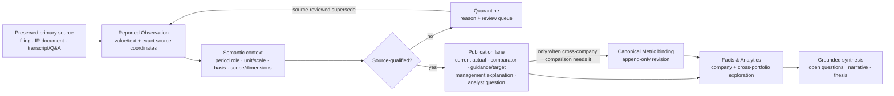

# Investment-grade grounded data roadmap

**Status:** local architecture and safety controls implemented; clean integration, Windows
deployment, live portfolio refresh, and every production database repair remain on HOLD. This
document does not itself authorize a production migration, Scheduler change, remote write control,
or database repair.

**Decision owner:** owner of `earnings-summary`.

**Scope:** the Windows-owned production database and Scheduler, the Mac review workflow, source
capture and extraction, KPI admission and correction, Facts & Analytics, cross-portfolio metric
grouping, synthesis, open questions, and thesis tracking.

## Current implementation and Operations disposition (2026-08-27)

The local worktree now contains the first coherent grounding and repair-control slice described by
this roadmap: a fail-closed Mac database boundary; terminal document-coverage receipts;
append-only KPI semantic revisions; qualification/publication lanes; report/Facts & Metrics scope;
canonical-admitted report, time-series, thesis, and readout reads; source-bound management-indicator
staging; writer-bypass retirement; a source-exact dry-run/apply executor with durable receipts; and
a read-only Operations review bundle whose Mac client requires independently enrolled host, code,
immutable database-lineage, registry, Scheduler-definition, and per-task action/checkout/wrapper
pins. These changes have not been deployed to Windows and have not changed production facts.

The management-indicator table is deliberately excluded from the Operations & Governance surface.
It is business research evidence, not operational telemetry or an operator action. The existing
transcript-extraction operation remains the owner: source or persistence failure stays visible in
its structured run result and leaves the transcript retryable. The expected Alembic head remains a
dynamic Operations-registry projection, so no new card, health claim, or mutating control is added.

The targeted `backfill_financial_fact_resolutions.py --fact-table --fact-row-id --apply`
path is an internal, receipt-bound repair primitive, not a supported cockpit workflow. It preserves
the canonical `OperationsRegistry`, `OperationsSnapshot`, and `build_operations_panel_view`
contracts unchanged; therefore it deliberately adds no Operations card, health claim, or operator
action. Production use remains subject to the same exact-database write lock, backup, review, and
single-writer release procedure as the governed KPI repair that invokes it.

The local linear 0032 repair/reader contract is now frozen. Its source-exact correction path,
three-way issuer and unit/scale identity, semantic-series identity, current-head resolution,
trusted Windows identity pins, whole-code repair seal, and evidence-lineage checks pass the related
361-test suite, strict Pyright, Ruff, diff, and sole-Alembic-head gates. Deployment of this
roadmap's local 0030–0032 changes nevertheless remains
on hold until this dirty, behind checkout is reconciled with `origin/main`, a fresh independently
pinned Windows review bundle is obtained, backup readiness is proven, the exact production repair
manifest passes dry-run and a new Sol judgment, and the owner approves that manifest. Migrations
0028 and 0029 are paired upstream with
application and Scheduler removals that are not present in the current local runtime. Applying the
migration files alone would drop `processing_tier` while local SQL still references it and remove
the podcast LLM budget while the local scheduled podcast route still exists. A separate Windows
task has completed the owner-authorized bounded 0028→0029 deployment of the paired upstream change
and validated it against a fresh 1.64 GB restore snapshot. Its database writer and Remote Desktop
hold are released. The separately authorized canonical SYSTEM
`\earnings-summary\portfolio_tracker_api` task is now registered, Running, and healthy under the
`portfolio-tracker-service` owner; the dashboard's real start action returns HTTP 200
`already_running`. Tailscale still exposes only the loopback dashboard through tailnet-only Serve.
That authorization does not extend to local 0030–0032. Integrate current `origin/main` in a clean
local landing task, preserve the sole linear 0030→0031→0032 chain above it, rerun the release gate,
and seek separate authority before preparing any further Windows migration.

Alembic downgrade is not a production recovery mechanism for migrations 0028–0032. Their
downgrades reconstruct retired or superseded structures and can discard post-migration evidence.
Production rollback means stopping writers, restoring a verified pre-migration database backup,
restoring schema-compatible application and Scheduler code, and re-running integrity and service
verification. No one should run `alembic downgrade` against the canonical Windows database as a
substitute for that restore procedure.

## 1. Product decision

The product earns its existence only if it is a more complete, more traceable, and more
investment-grade evidence system than a consumer finance product. Its advantage is not generic
market data or generic LLM prose. Its advantage must be:

1. preserve the exact filings, presentations, investor documents, and earnings transcripts,
   including prepared remarks and Q&A;
2. extract reported observations with enough source context to distinguish periods, units,
   accounting bases, scopes, dimensions, guidance, and comparators;
3. retain corrections and conflicts without rewriting history;
4. make the grounded observations explorable within a company and comparable across the
   portfolio through explicit semantic bindings;
5. use those observations to explain the quarter, answer open questions, and maintain a
   falsifiable thesis with citations.

If the application cannot reliably deliver those five outcomes, synthesis work should stop and
the project should fall back to an off-the-shelf product.

## 2. Smallest coherent architecture

The source observation remains authoritative. A Canonical Metric is a governed analytical mapping,
not a replacement for the filer label or source fact. Same-company reporting and retrieval need a
source-qualified observation and the correct publication lane; they do not need a Canonical Metric
binding. Cross-company comparisons and intentionally ontology-keyed thesis rules additionally need
a reviewed Canonical Metric Cell binding. A semantic anomaly may quarantine a fact; it may never
manufacture a correction.

Qualification and publication are separate decisions. A source-grounded guidance value,
historical comparator, management explanation, or analyst question can be valid evidence without
being a current-series actual. Numbers introduced by an analyst remain question evidence unless
management explicitly confirms them; they never become company facts merely because the transcript
is a primary-source artifact.

### 2.1 Reporting evolution without identity corruption

The system must expect issuers to rename, split, combine, redefine, or stop reporting metrics. It
must also expect two companies to use the same label for different economics. Therefore:

- preserve the verbatim filer label and all qualifiers; normalized names support search, never fact
  identity or automatic merging;
- link a renamed metric only through an evidence-backed definition revision with effective knowledge
  time, scope, basis, unit family, period kind, stock/flow behavior, dimensions, and comparability
  notes;
- split the analytical series when any of those semantics change materially, even if the display
  name stays the same;
- retain issuer-specific observations first, then add a reviewed Canonical Metric binding for the
  cross-portfolio question it can validly answer;
- represent discontinued, recast, restated, and newly introduced metrics explicitly. Absence is not
  zero, and a repeated value is not automatically a carry-forward.

This is the minimal architecture needed to survive changing reporting patterns without treating
names as definitions.

Semantic context itself has revision history in the local 0030 design. Its append-only context
chain keeps the reported fact unchanged while each new revision points to its predecessor, records
qualification, publication lane, reason, evidence identity, and knowledge time, and exposes exactly
one current head. A later source review appends `legacy_unknown → qualified` or
`legacy_unknown → quarantined`; it never updates history. Fact supersession remains reserved for an
incorrect value, period, source, or other reported observation—not metadata enrichment alone.
Migrations 0030–0032 are deployed; the 0033 report-reference disposition layer follows the same
guarded backup, migration, review, and live-verification path before its production cutover.

The portfolio rollout uses two deliberately separate gates. The **disposition gate** is green only
when every current in-scope fact has an append-only semantic head and every unmatched report KPI
reference has an exact, owner-scoped resolution revision. A reasoned quarantine or explicit
`unresolved:no_matching_reported_definition` closes that bookkeeping gap without making the value
usable. The **decision-grade admission gate** remains red while any current fact is quarantined,
legacy-unknown, missing, wrong-lane, or while a current report reference is unresolved. This split
prevents migration completion from being misreported as data quality.

Report references are governed independently from facts. Migration 0033 records the exact holdings
file JSON pointer, requested label and content hash, owner, issuer, reviewer, knowledge time, status,
and predecessor revision. Version 1 permits only `unresolved`; it categorically rejects resolved or
retired states and cannot bind a definition. A later resolved state requires a source-reviewed
mapping shared by every reader before it can exist. Missing or malformed per-ticker holdings
configuration is a typed blocking state, never an omitted input, and the payload ticker must match
the portfolio ticker and file identity before any reference can be synthesized. Duplicate exact
labels remain explicitly ambiguous rather than being silently bound. The rollout never creates an
empty definition or ontology alias merely to remove an audit count. Cross-company aliases remain a
later, evidence-led ontology decision.

Disposition execution uses the same independent Windows authority chain as source-reviewed repair:
trusted host/code/database/Scheduler pins, a fresh Operations review bundle, a preverified backup
and restore receipt, a deterministic dry-run receipt, a content-bound Sol PASS, and the owner's
exact manifest hash. The executor does not create its own authority evidence or accept caller-supplied
lineage claims. The fact/reference writes and an immutable manifest-bound commit marker share one
database transaction. If receipt publication fails after commit, the next exact retry proves that
marker and publishes a replay receipt without mutating data or requiring a now-stale backup claim.

Deterministic derived metrics follow the same admission boundary. Every arithmetic input retains
its own tier-winning source-document identity. Arithmetic over normalized FMP inputs remains
`legacy_unknown` for decision-grade consumers even when the calculation is correct; it is not
silently relabeled GAAP/consolidated. A financial-fact derivation is eligible for deterministic
GAAP/consolidated admission only when every selected input is SEC-official; the live SEC
Companyfacts `sec_companyfacts_snapshot` path is explicitly included in that derivation read. A
transform reads the canonical resolved current series and inherits admission only when both current
and prior observations are admitted current actuals with the same definition, exact reported label,
unit scale, accounting basis, consolidation scope, and dimensions. An applied override carries its
own source and remains unclassified until independently reviewed; it cannot inherit the replaced
fact's semantic admission. Otherwise the transform remains unclassified and thesis evaluation
fails closed.

## 3. Mac-to-Windows review path

### 3.1 Authority

- Windows remains the sole production writer and the sole authority for `data/portfolio.db`, live
  Task Scheduler registration, managed services, Scheduler receipts, and production source bytes.
- The Mac is a review and orchestration client. It must not infer Windows health from checked-in
  XML, a stale hostname, a copied database, or cached task output.
- The exact HTTPS origin printed by live Windows `tailscale serve status` is the only supported
  Mac-to-Windows network identity. Flask stays on Windows loopback; Funnel, LAN binding, raw
  Tailnet-IP binding, and a second database writer are out of scope.

### 3.2 Read path: build first

Add one typed, read-only review bundle to the existing Operations path. Do not add a second service
or a generic SQL endpoint.

First restore the existing Operations surface. The initial live audit observed HTTP 500 from both
`/api/work-os/portfolio` and `/api/panel/operations` while `/api/overview` and the ViewSpec catalog
remained readable. Local recovery and review-bundle tests now pass, but that code is not deployed on
Windows 0029 and the two live paths have not yet been revalidated through the pinned review path.
The failure path must remain outside the review bundle's trust chain: schema preflight or an
unavailable product table may not prevent the bounded operational snapshot from rendering.
Operations must use a schema-drift-tolerant bounded read or precomputed database-health receipt and
must report partial/degraded state explicitly.

The Windows bundle should project sanitized read models derived from existing authorities:

- `OperationsRegistry` and `OperationsSnapshot`;
- the existing ten-minute Scheduler/service observation receipts;
- expected and actual Alembic revision, database open/integrity status, and backup/restore receipt;
- latest pipeline and validation outcomes;
- scoped KPI semantic census for active portfolio companies;
- source-provenance coverage and quarantine counts;
- the bundle observation time, evidence times, schema version, and content hash.

Define a closed review-bundle DTO rather than serializing `OperationsRegistry` or
`OperationsSnapshot` directly. Allowlist health, state, timestamps, counts, version matches, and
stable digests only. Do not emit command text, arguments, absolute checkout/database paths,
environment, source bodies, or exception payloads. The host, database instance, Scheduler checkout,
and wrapper use stable non-secret instance identities or digests that the Mac can compare across
observations without learning a filesystem path.

Delivery:

1. Windows exposes `GET /api/operations/review-bundle` through the existing Tailscale Serve origin.
2. A Mac CLI fetches that endpoint, validates a closed Pydantic schema, and writes a
   content-addressed intermediate under `.tmp/windows_review/<observation-version>.json`.
3. The CLI rejects a changed origin, malformed payload, future timestamp, stale Scheduler receipt,
   unexpected database identity, or schema mismatch.
4. The Operations UI links to the same projection so the owner and an agent review identical state.

This is a read-only capability. It does not run jobs, execute SQL, modify Scheduler state, or expose
raw secrets, command output, source bodies, or unrestricted filesystem paths.

Company/fact exploration continues through the existing ViewSpec, source, report, and grounded Ask
APIs. The review bundle covers bounded operational and data-quality state that those product APIs do
not expose. If another database question becomes recurring, add a typed read model to the bundle or
an existing product API; never add arbitrary SQL transport.

The endpoint must read precomputed integrity, backup, Scheduler, and service receipts. It must not
run `PRAGMA integrity_check`, Scheduler commands, subprocesses, network calls, or unbounded database
queries in the request path.

### 3.3 Consensus before a production write

A production repair follows one path:

1. **Observe:** fetch a fresh Windows review bundle and identify its content hash.
2. **Propose:** create a typed, allowlisted maintenance manifest tied to that hash. For KPI repair,
   use a hardened successor to `kpi_semantic_refresh.v1`; do not accept SQL or shell text. The
   manifest records Source Identity, Content Identity, Observation Version, knowledge time, exact
   source locator, expected current supersession/context chain head, Logical Idempotency Key,
   database schema identity, backup receipt, intended action, and expected row effects. Supported
   actions include append-context revision, quarantine, and source-backed supersede.
3. **Prove:** run deterministic dry-run validation against the Windows database, including scope,
   source eligibility, period/unit/context checks, chain-head identity, locks, backup freshness, and
   expected row effects.
4. **Judge:** Sol independently reviews the manifest, source evidence, deterministic receipt, and
   acceptance rubric without receiving the implementer's preferred verdict.
5. **Approve:** the owner authorizes the exact manifest hash for any production mutation.
6. **Apply on Windows:** the existing Windows runtime acquires the canonical write-set lock and
   executes the allowlisted command. Phase 1 remains a Windows-local operator command. A remote
   Apply button is explicitly deferred until the same authorization, idempotency, confirmation,
   and durable-receipt contract is proven.
7. **Verify:** fetch a new review bundle, rerun semantic and validation gates, and link the before,
   dry-run, Judge, apply, and after hashes in one repair receipt.

The stable manifest carries intent and its Logical Idempotency Key; it does **not** carry an Attempt
Identity. Each dry-run or apply execution creates a distinct Attempt Identity in its durable receipt
and correlates that receipt to the unchanged approved manifest hash. A retry therefore preserves the
owner-approved intent while producing a new attributable attempt.

Here, consensus is conjunctive, not a vote: deterministic proof must pass, Sol must not return
`BLOCK`, `HOLD`, or `ABSTAIN`, and the owner must approve the exact manifest hash. Any one blocker
stops the write. The durable Windows repair receipt preserves the exact reviewed bundle or its
content-addressed archive; the Mac `.tmp` copy is a convenience, not the audit authority.

The governed Judge issuance/completion helper is available and is used for local design and code
review. A production write still needs a new sealed receipt tied to the exact Windows review bundle,
maintenance-manifest hash, and deterministic dry-run evidence. The current local review does not
authorize that later mutation. Infrastructure failure yields `HOLD`/`ABSTAIN`, never a synthetic
pass.

Before the first production repair, the executor must prove all of these failure modes: stale review
bundle, unexpected schema, missing or stale backup, changed chain head, lock contention, replayed
Logical Idempotency Key, ineligible source, mismatched locator/value/period/unit, unexpected row
count, and post-write verification failure. Every attempt emits a durable Windows receipt even when
no row changes. The executor's evidence policy is lane-aware: issuer/SEC evidence is preferred for
reported actuals; a management transcript confirmation may qualify its confirmed claim; normalized
provider data remains a labeled fallback. No universal hard-coded source allowlist may silently
exclude an otherwise eligible evidence class or promote a fallback into an issuer fact.

No generic remote shell, remote SQLite connection, database file sync, or arbitrary job runner is
needed. Read access becomes regular immediately; remote mutation remains narrow and earned.

### 3.4 Scheduler access

The existing Windows collector runs every ten minutes, but its current task-state receipt is not
sufficient to prove execution history. Extend the collector and its typed receipt before relying on
it for Mac review. The vNext review bundle must distinguish:

- declared task versus registered task;
- enabled/disabled/running/missing state;
- registered checkout and wrapper identity;
- last attempt versus last successful run;
- next expected run and receipt freshness;
- lock contention, deferred items, failures, and never-attempted items.

The Mac may request a refresh only after a separate bounded operator action is designed. The first
slice relies on the existing ten-minute observation cadence and exposes no enable, disable, run, or
delete control.

## 4. Current evidence and known failures

### 4.1 Portfolio scope

The live portfolio contains 11 companies: BKNG, BN, MELI, META, NOW, NU, NVO, RBRK, UBER, VEEV,
and WIX.

Current `origin/main` no longer persists a company-by-company `processing_tier`. It derives two
different concepts from Coverage Role: every active `portfolio` and `evaluation` name has governed
Research Level, while scheduling is P1 daily/event-driven for portfolio and P2 weekly/event-driven
for evaluation (watchlist is also P2 but only monitored). There is therefore no authoritative
within-evaluation subset receiving weaker or stronger financial-data rigor today: all evaluation
names are governed. The evaluation UI may rank names by candidate score, but that score is not a
Research Level or data-quality exemption. Per-item depth/budget lives in
`research_tasks.budget_tier` and `research_proposals.budget_tier`; time-bounded promotion lives in
`research_hot_flags`. Neither is a persisted evaluation-company sub-tier.

The canonical Windows database was queried read-only at schema 0029 on 2026-08-27. Its active
analyzed roster is 69 names: 11 portfolio, 38 evaluation, and 20 watchlist. The exact evaluation
roster is: ABNB, AMZN, ASML, AVDV, AVGO, AVUV, BHP, CDNS, DHR, DLO, DUOL, FANG, FCX, FNV, GOOG,
IFNNY, LITE, LLY, MDB, MDWD, MRNA, MONOL, MODY, NTRA, NVDA, ON, ORCL, PCOR, QCOM, SNOW, SNPS,
SOFI, TEM, TMO, TOST, TSM, VDE, and VWO. The active watchlist is: AMD, BAM, BIPC, BRK-B, CRWD,
DDOG, HDB, ISRG, JPM, KVYO, LMND, MA, MRVL, MSFT, MU, NEE, PANW, ROP, SE, and TDG. The much larger
`index_member` reference universe is deliberately excluded by `ACTIVE_LIST_TYPES` and
`ANALYZED_LIST_TYPES`. The owner can now choose a smaller evaluation rollout subset without
changing the governed quality bar for any facts those companies surface.

The live Facts & Metrics catalog exposes 5,468 ticker/metric entries:

- 4,898 capture-origin entries;
- 570 analyst-origin entries;
- 4,054 rendered as SEC-XBRL sourced;
- 671 rendered as LLM-extracted;
- 288 rendered as IR-document sourced;
- 94 rendered as FMP sourced;
- 361 without source metadata in the rendered catalog.

The rendered catalog omits a unit label for 4,834 entries. This is a review trigger, not proof that
the stored fact unit is missing; the production database census must distinguish a presentation
gap from missing persisted semantics.

### 4.2 Confirmed corruption and source-tie-out queue

| Company | Failure | Required disposition |
|---|---|---|
| NU | `Total customers` merged wrong-period/wrong-value observations: Q4'24 displays 95 instead of the source-backed 114.2; Q2'25 displays 114 instead of 122.7. Later 2025 points also require source review. | Supersede each wrong fact from its primary document; bind current-period, management KPI, consolidated scope, and source scale. Never repair from monotonicity alone. |

NU is the only row currently supported by an evidence-complete source tie-out in this roadmap. The
following are **observed suspects requiring source tie-out**, not confirmed corruptions:

| Company | Preliminary signal | Evidence required before disposition |
|---|---|---|
| NOW | A non-GAAP operating-margin view may contain GAAP/FMP values. | Exact definition/fact IDs, consumer, current chain head, period/unit/basis/scope, issuer reconciliation Content Identity and locator, observed value, and proposed split/rebind/supersede action. |
| NVO | A `Capex / Revenue` view may mix fiscal-year denominator and quarterly-period semantics. | Exact numerator/denominator/fact identities, source period coordinates, reported ratio if any, affected consumer, and source-backed disposition. |
| VEEV | A ratio history may mix percentage, multiple, and prior-year comparator observations. | Exact definition/fact IDs, unit family, period role, source row/column/page coordinates, consumer, chain head, and proposed disposition. |
| RBRK | ARR/NRR observations may be bound to the wrong reported periods. | Exact definition/fact IDs, row/column headers, period/unit/basis/scope, consumer, source Content Identity and locator, and chain-aware disposition. |

Every tie-out manifest must also record the Source Identity, Observation Version, knowledge time,
observed value, expected disposition, and primary-source artifact. A zero-row query or isolated
outlier is not enough to call a series corrupt.

One-off non-monotonic or unusual values may be legitimate. NVO's 61.6% operating margin is an
example of why anomaly rules must trigger review rather than overwrite facts.

### 4.3 Operational blockers

- The production semantic-context migration and refresh are not deployed.
- The initial live audit found HTTP 500 on `/api/work-os/portfolio` and `/api/panel/operations`.
  Local recovery tests are green, but live Windows 0029 has not yet received or revalidated that
  compatible read-only slice. Proven HTTP 200 normal/degraded behavior remains a Phase 0 prerequisite.
- Mac has no enrolled owner-approved Windows identity-pin manifest or accepted live review bundle,
  so production repair cannot be applied from the current session.
- The focused local grounding and migration suite is green, but the full release gate has not been
  run on a clean checkout reconciled with current `origin/main`.
- The current governed Judge episode reviews local code only. No production write may reuse it as
  approval for a later Windows manifest or database state.
- Live Scheduler health must be established from the Windows receipt, not repository declarations.

### 4.4 Systemic control defects to remediate

| Current defect | Required control | Roadmap phase |
|---|---|---|
| Read-side normalization can strip qualifiers such as geography or consolidation scope, and write-side resolution can reuse definitions from a normalized name/unit key. | Preserve and render the verbatim label; resolve only inside an exact semantic key. Add writer and reader adversarial tests proving same-label/different `Brazil`, `consolidated`, segment, basis, scope, and comparator observations cannot collapse or reuse a definition. | 0 writer closure/shadow tests, 1–2 reader cutovers |
| KPI facts do not consistently carry typed scope, comparator role, count scale, stock/flow behavior, or publication lane. | Record these in append-only semantic context at the write boundary; missing fields remain `legacy_unknown` or quarantine until source review. | 0 dual-write, 1–2 backfill |
| Daily validation lacks KPI-specific monotonicity, magnitude, source-disagreement, duplicate, and suspicious-repeat checks. | Add deterministic detectors as review triggers. Monotonicity runs only for definitions with a declared invariant; no detector manufactures a value. | 1 then scheduled in 2 |
| The current validation gate cannot fail because implemented findings resolve to warning severity. | Define cutover-specific blocking conditions: missing/`legacy_unknown` context, wrong publication lane, ineligible source, changed chain head, or unresolved conflict in a decision-driving/current cell. Keep unusual-but-source-backed values as warnings. | 0–1 |
| Some production/repair paths bypass guarded persistence or mutate a fact in place. | In Phase 0 inventory every active KPI writer and close or disable each bypass before dual-write exits. At minimum, route or retire `fix_kpi_series.py`, `backfill_fiscal_period_stamps.py`, and `mark_kpi_cadence.py`; fail a static SQL mutation guard on direct update/insert outside approved migration/fixture code. Historical repairs use only the hardened append-context/supersession executor. | 0 writer closure; 1 reviewed backfill only |
| Automatic division by one million treats a magnitude anomaly as proof of the correct value. | Remove the guess-fix. A scale anomaly quarantines the observation and requires source value, source scale, normalized value, and supersede evidence. | 0 executor, 1 NU regression |
| Existing semantic scope/audit logic can omit `legacy_unknown`, allowing it to evade a gate while readers hide it. | Count every status and lane in the shadow census; cut over a consumer only after its explicit unknown/missing set reaches zero. | 0–2 |
| The original one-row immutable semantic context could not append a qualification decision after eager `legacy_unknown`. | The local design now uses an append-only context revision chain and one current head per fact. Preserve its unknown→qualified and unknown→quarantined lifecycle proof through clean integration and deployment. | 0 integration/release proof |
| The malformed literal `%` in `fetch_news.py` help text previously blocked the configured release gate. | The literal is fixed locally and `fetch_news.py --help` succeeds. Run `make check` in the clean integration state, triage every remaining failure under the repository ratchet, and prohibit deployment until the configured gate is green or a genuinely unrelated pre-existing failure is evidenced under that policy. | 0 release gate |

## 5. Source-specific extraction contract

### 5.1 SEC filings and XBRL

Deterministically preserve concept QName, taxonomy version, context period, unit, decimals/scale,
axes, members, filing accession, filed-at time, and source coordinates. Do not use the concept label
alone as a Canonical Metric identity. Comparative and dimensional contexts remain separate reported
observations.

### 5.2 IR presentations, releases, and supplements

Preserve document bytes and capture page, table, row label, column header, verbatim excerpt,
reported period, source scale, accounting basis, consolidation scope, and dimensions. LLMs may
classify a cell only from the primary document and must return the typed context. A summary derived
from the document can aid retrieval but cannot admit a fact.

### 5.3 Earnings transcripts and Q&A

Preserve speaker, role, prepared-versus-Q&A section, timestamp/line coordinates, source URL,
capture time, and exact text. Classify statements as reported actual, historical comparator,
guidance, target, management explanation, or analyst question. Numeric claims in questions are not
company-reported facts unless management confirms them. Qualitative explanations and commitments
remain grounded narrative evidence even when they are not numeric facts.

### 5.4 FMP and other normalized providers

Treat normalized provider values as explicit fallback observations. Preserve provider endpoint,
payload bytes/hash, period, currency, unit, and provider field. Do not label a value GAAP,
non-GAAP, quarterly, annual, or consolidated without source evidence. Prefer an issuer/SEC source
when a conflict exists and retain both observations with an explicit resolution.

### 5.5 LLM-derived artifacts

LLM extraction is a transformation, not a source. Every source-qualified claim must terminate at a
preserved primary-source locator. Model, prompt/schema version, attempt, confidence, and repair path
remain attributable. Malformed output, missing source context, or conflicting evidence yields
quarantine or abstention, never a guessed fact.

## 6. Admission gates

A Reported Observation may feed Facts & Analytics, reports, Ask, or thesis synthesis only when all
applicable gates pass:

1. **Source gate:** preserved eligible source and verifiable locator, with explicit Source Identity,
   Content Identity, Observation Version, and knowledge time.
2. **Identity gate:** exact reported label plus stable observation identity.
3. **Period gate:** period start/end, period kind, and role are explicit.
4. **Unit gate:** unit family, currency, source scale, and normalized value reconcile.
5. **Basis/scope gate:** accounting basis, consolidation scope, and dimensions are explicit.
6. **Plausibility gate:** deterministic range, magnitude, unit, and cross-source conflict checks.
7. **Qualification gate:** the observation is source-qualified or quarantined, independently of how
   it will be published.
8. **Publication gate:** only source-qualified current actuals may render as current series values.
   Qualified guidance/targets, comparators, management explanations, and analyst questions use
   separate lanes; an analyst's number is evidence of the question, not a company fact, unless
   management confirms it.
9. **Canonical gate, when applicable:** cross-company comparisons and intentionally ontology-keyed
   thesis rules require an attributable Canonical Metric and Canonical Metric Cell binding based on
   semantics, not name similarity. Same-company reporting and source retrieval do not.

Monotonicity applies only to metrics whose Canonical Metric Definition Revision explicitly declares
a cumulative/stock invariant. It is never a universal KPI correction rule.

## 7. Remediation roadmap

### Phase 0 — establish the Windows review path and safe baseline

**Goal:** the Mac and owner can see the same current Windows truth, and semantic controls can be
measured without hiding legacy data or changing production readers.

1. Fix both `/api/work-os/portfolio` and `/api/panel/operations` HTTP 500. Prove Operations returns
   HTTP 200 during normal operation and when an optional product table/migration is absent, with the
   latter rendered as an explicit degraded receipt.
2. Extend the Scheduler collector/receipt to vNext so checkout/wrapper identity, last attempt, last
   success, next expected run, receipt freshness, and never-attempted state are observable.
3. Add the typed read-only Operations review bundle and Mac fetch/validation CLI; prove access from
   the Mac using the exact origin from live Windows `tailscale serve status`.
4. Run the guarded database backup and restore drill; record integrity, foreign-key, Alembic, backup
   identity, and restore evidence.
5. Integrate the local append-only semantic-context revision chain into a clean current-main state,
   then prove on the restored Windows snapshot that unknown→qualified and unknown→quarantined
   revisions preserve the fact ID, predecessor history, and one current head. Do not deploy yet.
6. Inventory every active production KPI writer. Route it through the guarded persistence/context/
   supersession boundary or explicitly disable it; close the known direct-mutation utilities before
   any dual-write exit. Add the static SQL mutation guard and same-label/different-semantics writer
   tests.
7. Build and migrate the semantic schema plus writer dual-write against the restored test database;
   run the lifecycle, writer-closure, exact-key, shadow, and hardened-executor dry-run tests without
   production deployment. Persist the deterministic dry-run receipt for the exact proposed manifest.
8. Bind a fresh governed Judge episode to the exact Windows bundle, completed deterministic dry-run
   receipt, and proposed maintenance-manifest hash; the local code-review episode is not reusable
   authorization and the Judge never precedes its evidence.
9. Keep the local `fetch_news.py` percent-help fix, run the full configured `make check`, and triage
   every remaining failure under the repository ratchet. Do not deploy until the gate is green or a
   genuinely unrelated pre-existing failure is evidenced under that policy.
10. Deploy the semantic schema and writer **dual-write** only. Preserve existing reader behavior
    while every new observation records qualification plus its publication lane.
11. Run the live shadow census that counts every semantic status, including `admitted`,
    `quarantined`, `legacy_unknown`, and missing context. Report the counts separately for
    report/thesis/open-question consumers and the full Facts & Metrics surface. `legacy_unknown` must
    never be treated as admitted or omitted from a gate.

Do not refresh, quarantine, or supersede production facts in this phase.

**Exit evidence:** HTTP 200 Operations in normal and schema-drift fixtures; fresh cross-machine review
bundle; vNext Scheduler receipt; verified backup and restore; expected Alembic head; exact portfolio
fact counts for every status and publication lane; governed Judge receipt path; hardened executor
failure tests; append-only semantic revision lifecycle proof; complete writer census and mutation
guard; exact-semantic-key writer tests; green configured release gate; no unknown live writer.
Existing readers still render the pre-cutover behavior.

### Phase 1 — repair facts that drive decisions

**Goal:** every KPI used in reports, thesis rules, open questions, or current narrative is source
correct and clickable.

Order work by harm, not by easiest source:

1. NU customer series and every later affected quarter;
2. source-tie-out manifests for the preliminary NOW, NVO, VEEV, and RBRK suspects; repair only the
   cases that become evidence-complete confirmed corruptions;
3. every remaining report/thesis/open-question KPI in the 11-company portfolio.

For each series: inspect every source document in scope, bind facts already correct and anchored to
reviewable sources, supersede incorrect facts from a later reviewable source document, quarantine
unresolved observations, and rerun reports plus ViewSpec.

The operational queue is deterministic and read-only until a reviewed manifest reaches the existing
guarded executor. It counts only current fact heads (superseded observations remain queryable history
but cannot block cutover), resolves LLM summaries and synthesized documents to their preserved parent
document, requires the portfolio owner, KPI definition, fact, synthetic child, attributable parent,
and evidence-document version to agree on issuer, and emits one of: missing ledger capture, missing
fulltext capture, missing current binding, missing source identity, issuer mismatch, non-reviewable
source, incomplete bounded evidence search, no exact numeric evidence match, or source review
required. Evidence nodes and text are loaded once per document under explicit node, text, and match
budgets; exhausting any budget remains visible and never masquerades as a complete negative search.
Single-period artifacts require a document period. Multi-period source packages such as historical
IR spreadsheets instead retain a null document period and bind each fact's own fiscal period plus
its exact source locator; operators must never invent one document period for a multi-period file.
An exact numeric node match is only a review candidate. It never supplies accounting basis,
consolidation scope, dimensions, publication lane, scale, or comparability without verbatim source
evidence.

After that repair—and not before—explicitly cut report, thesis, open-question, and current-series
readers over to qualification-plus-lane predicates. First run them in shadow comparison, then require
zero `legacy_unknown`, missing, quarantined, guidance, comparator, or analyst-question observations
in the current-actual lane. Only this bounded consumer scope becomes fail closed in Phase 1.

**Exit evidence:** zero `legacy_unknown` or missing contexts in decision-driving facts; zero
quarantined or wrong-lane facts rendered as current actuals; every rendered value source-clicks to
the supporting primary document; every confirmed corruption has an append-only supersession chain,
expected chain-head proof, durable repair receipt, and before/after tests. Suspects without complete
evidence remain quarantined or explicitly unresolved; they are not guess-fixed.

### Phase 2 — refresh the entire Facts & Metrics surface

**Goal:** every metric the owner can discover in Facts & Metrics is honestly qualified and routed to
the correct publication lane before that surface becomes fail closed.

Partition the 5,468-entry catalog by source path:

1. deterministic SEC-XBRL context backfill where concept, context, unit, scale, period, and dimensions
   are already sealed;
2. primary IR-document re-extraction where row/column/page context is available;
3. transcript re-extraction that separates prepared remarks, Q&A, actuals, guidance, and questions;
4. FMP fallback review and source conflict resolution;
5. LLM-summary observations re-extracted from their preserved parent primary document;
6. missing-source entries quarantined until provenance is recovered.

Use one writer and checkpoint by ticker, source document, extraction schema version, and source
Content Identity. Retries resume; they do not restart the portfolio or duplicate facts.

Run the same bounded queue first for report-driving definitions and then for the Facts & Metrics
remainder. Capture ledger identity before fulltext; capture fulltext before semantic review; and
require a content-addressed review batch before constructing a repair manifest. FMP and other
non-reviewable rows must be re-sourced to issuer or SEC evidence or remain explicitly excluded—an
upstream normalized feed cannot become primary authority merely because its value matches.

Run the long-tail refresh behind unchanged readers and compare the shadow output. Then explicitly
cut the Facts & Metrics readers over and fail closed only after every in-scope observation is
source-qualified into a lane or quarantined with a reason.

**Exit evidence:** every in-scope fact is source-qualified into a publication lane or quarantined;
zero `legacy_unknown` and zero missing context; no LLM-derived document is final authority; catalog
source/unit display reconciles to stored metadata; quarantine age and review backlog are visible in
Operations; reader tests prove current actual, comparator, guidance/target, management explanation,
and analyst-question isolation.

### Phase 3 — make Canonical Metrics useful without erasing source nuance

**Goal:** enable cross-portfolio analysis through reviewed bindings rather than fuzzy name merging.

Start only with categories that answer recurring investment questions:

- customer/base and penetration;
- engagement, volume, and transaction activity;
- monetization and unit economics;
- retention, expansion, and backlog/ARR;
- growth and guidance;
- profitability and cash generation;
- capital intensity;
- balance-sheet, credit, and risk quality;
- product, segment, and geography mix.

For each Canonical Metric, define unit family, period kind, basis, scope constraints, allowed
dimensions, comparability notes, and any declared invariant. Bind source observations through
append-only Fact-Cell Canonical Binding Revisions. Keep reported labels and source dimensions visible
alongside the canonical category.

**Exit evidence:** a small reviewed category set supports useful portfolio comparisons; bindings can
be explained source-by-source; no analytics query needs to collapse GAAP/non-GAAP, current/comparator,
quarter/FY, or consolidated/segment values.

### Phase 4 — rebuild Facts & Analytics around evidence

**Goal:** make the richer repository materially easier to explore than consumer finance products.

Add, in order:

1. source/basis/period/scope chips on every metric series;
2. qualification/quarantine/conflict state, publication lane, and source-clickthrough;
3. company-level comparison of reported, guidance, comparator, and management explanation lanes;
4. cross-portfolio category exploration using Canonical Metric bindings;
5. explicit comparability warnings and drill-down to the reported observation;
6. saved analytical views only after the underlying categories are proven useful.

Do not add another charting framework, semantic database, or generic BI layer. Extend ViewSpec and
the existing fact ontology.

**Exit evidence:** an owner can answer a company or portfolio question, see why observations are
comparable, and reach the exact supporting source without leaving the product.

### Phase 5 — gate narrative, open questions, and thesis state on grounded facts

**Goal:** synthesis accelerates judgment without becoming a second source of truth.

1. Narrative claims cite source-qualified facts or grounded transcript/document passages.
2. Conflicts and quarantines are surfaced as open questions, not silently resolved in prose.
3. Management explanations identify prepared remarks versus Q&A and preserve speaker attribution.
4. Same-company thesis rules bind to source-qualified observation identities or explicit qualitative
   evidence identities. Only intentionally ontology-keyed or cross-company rules require Canonical
   Metric Cells; no rule binds a loose display label.
5. New evidence records whether it confirms, pressures, or leaves a thesis condition unresolved;
   the LLM explains the inference but does not mutate owner thesis state without the existing owner
   action contract.
6. Cross-portfolio synthesis uses only comparable source-qualified cells and states coverage gaps.

**Exit evidence:** every consequential narrative sentence has a replayable evidence path; open
questions close only from new evidence or an owner action; thesis changes preserve the source fact,
inference, and owner decision separately.

### Phase 6 — harden and decide whether the product earns continued investment

**Goal:** prove the differentiated loop works before expanding features.

Run representative company and portfolio tasks covering normal, empty, long-context, malformed,
adversarial, degraded, and conflicting-source cases. The first owner-facing comparison set is:

1. reconstruct NU's customer series and click every point to the exact table/transcript evidence;
2. separate a company's reported actual, historical comparator, guidance/target, management
   explanation, and analyst-question numbers without cross-lane leakage;
3. explain a material quarter-over-quarter margin change using the table plus management Q&A, while
   preserving GAAP/non-GAAP basis;
4. compare ARR/backlog/retention across eligible portfolio companies and state why each cell is or
   is not comparable;
5. compare capital intensity only when numerator, denominator, currency, and period kinds align;
6. answer an open question from new filing or Q&A evidence and preserve unresolved conflict;
7. show what new evidence confirms, pressures, or leaves unchanged in the thesis without mutating
   the owner's thesis decision;
8. reconcile conflicting issuer, SEC, transcript, and normalized-provider observations with a
   visible resolution history.

These tasks become the practical “beats consumer tools” benchmark: breadth alone does not pass if
the answer is not more grounded, qualified, and explorable. Deterministic gates remain primary; Sol
or another calibrated Judge evaluates semantic quality where no exact oracle exists. Do not claim a
statistical error rate until the owner ratifies a Tolerable Error Rate and confidence target.

Continue investing only if the product demonstrates all of the following:

- broader company-reported metric and transcript/Q&A coverage than the chosen off-the-shelf
  comparison;
- primary-source clickthrough and correction history for every report-driving fact;
- materially useful within-company and cross-portfolio exploration;
- synthesis that identifies evidence, uncertainty, and thesis impact more reliably than a generic
  earnings summary;
- an owner workflow that saves decision time without increasing undetected data risk.

If those outcomes are not demonstrated after Phases 0–5, stop adding synthesis features and retain
only the source archive, validated fact repository, and any analytics that are independently useful.

## 8. Priority order and dependencies

| Priority | Deliverable | Depends on | Blocks |
|---|---|---|---|
| P0 | restore Operations and add vNext Scheduler receipts | existing Tailscale Serve and bounded collectors | every trustworthy remote review |
| P0 | Windows review bundle and Mac fetch path | healthy Operations and vNext receipts | every trustworthy remote review |
| P0 | backup/restore, governed Judge receipts, hardened executor | Windows review path | any consensus production repair |
| P0 | append-only semantic revision schema and lifecycle tests | backup and migration proof | dual-write and metadata qualification |
| P0 | active-writer closure, dual-write, exact-key tests, all-status shadow census | guarded persistence/executor | source repair and reader cutover |
| P0 | repair known release-gate failure and run full `make check` | Phase 0 code complete | any deployment |
| P0 | NU correction and evidence-complete suspect tie-outs | source documents and hardened supersede path | trustworthy current reports |
| P1 | report/thesis KPI refresh and bounded reader cutover | semantic shadow census | grounded narrative and thesis rules |
| P1 | complete Facts & Metrics refresh and reader cutover | source-specific adapters | honest metric exploration |
| P1 | source/unit/catalog reconciliation | fact-level census | operator backlog truth |
| P2 | initial Canonical Metric categories | source-qualified facts | cross-portfolio analytics |
| P2 | evidence-first Facts & Analytics UX | canonical bindings and source locators | differentiated exploration |
| P2 | synthesis/thesis evidence gate | source-qualified facts and grounded retrieval | investment-grade narratives |
| P3 | broader categories and saved views | demonstrated owner usage | expansion |

## 9. Acceptance scorecard

| Surface | Required evidence |
|---|---|
| Windows operations | Fresh typed Scheduler/service/database review bundle from the live Windows host; declared configuration alone is insufficient. |
| Review-bundle safety | Closed sanitized DTO exposes no command, argument, absolute path, environment, secret, or raw exception; stable host/database/checkout/wrapper digests reject identity drift. |
| Database safety | Verified online backup and restore; forward migration; append-only correction; no destructive backfill. |
| Repair consensus | Stable approved manifest hash and Logical Idempotency Key survive retries; every dry-run/apply has a distinct Attempt Identity and durable before/after or failure receipt. |
| Semantic lifecycle | `legacy_unknown` can append a qualified or quarantined context revision with one current head while fact ID and prior revisions remain unchanged. |
| Writer closure | Every active production KPI writer is inventoried and guarded or disabled; static checks reject unapproved direct fact mutation. |
| Release gate | Full configured `make check` is green before deployment, subject only to the repository's evidenced pre-existing-failure ratchet. |
| Report facts | 100% of rendered current KPI cells are source-qualified, in the current-actual lane, source-clickable, and free of unresolved semantic conflicts. |
| Facts & Metrics | 100% of in-scope facts source-qualified into an explicit lane or quarantined; zero `legacy_unknown` and zero missing contexts after cutover. |
| Provenance | 0 source-qualified facts whose terminal evidence is only an LLM-derived document. |
| Semantics | Period role, unit/scale, basis, scope, dimensions, qualification, and publication lane are explicit for every source-qualified fact. |
| Canonical analytics | Every cross-company comparison uses reviewed Canonical Metric Cell bindings and exposes comparability constraints. |
| Transcripts/Q&A | Speaker, section, and locator preserved; analyst-question numbers are not qualified as company facts without management confirmation. |
| Synthesis | Consequential claims cite source-qualified facts or grounded passages and state conflicts/coverage gaps. |
| Thesis | Evidence, inference, and owner decision remain separate, attributable revisions. |

## 10. Explicit non-goals

- no second production database or bidirectional Mac/Windows SQLite sync;
- no generic remote SQL, shell, Scheduler, or filesystem endpoint;
- no public hosting, Funnel, multi-user tenancy, or new authentication platform;
- no fuzzy cross-company merge based only on metric names;
- no universal monotonicity correction;
- no deletion of raw sources or superseded facts;
- no new vector database, warehouse, ontology service, or BI product until SQLite/ViewSpec evidence
  proves they are necessary;
- no remote Apply button in the first review-path slice;
- no new synthesis feature while report-driving facts remain ungrounded.

## 11. Recovery and rollback

- A review-bundle rollout is reversible by removing the read-only endpoint and Mac client; it owns
  no durable business state.
- Semantic migration rollback is permitted only before production context rows exist. After use,
  preserve the table and roll application code forward; append-only context and supersession history
  must not be discarded.
- Dual-write and each bounded reader cutover are separate releases. A reader can return to the prior
  path while its shadow discrepancy is investigated, but newly written semantic context remains;
  never relabel `legacy_unknown` as qualified to make a cutover pass.
- A failed refresh transaction rolls back as a unit. A successful correction is reversed only by a
  later source-backed superseding observation.
- Scheduler registration changes use the generated manifest/runbook and are verified against live
  Task Scheduler. Source configuration never proves registration.
- Recovery is not complete until a backup has been restored to a throwaway database and passed
  integrity, foreign-key, schema, and semantic audit checks.

## 12. Immediate next implementation slices

1. **Operations recovery slice:** fix both HTTP 500 paths, make the bounded snapshot tolerant of
   optional schema drift, add vNext Scheduler receipts, and prove normal/degraded HTTP 200 behavior.
2. **Mac/Windows read slice:** typed review-bundle model, read-only endpoint, Mac fetch CLI, tests,
   no-leakage golden tests, stable identity-drift rejection, Operations link, and exact-live-origin
   Windows/Mac acceptance proof.
3. **Safety-control slice:** backup/restore evidence, governed Judge receipt restoration, hardened
   stable repair manifest/executor, per-attempt receipt identities, lock/idempotency/failure tests,
   and durable no-op/failure receipts.
4. **Semantic/writer test slice:** on a restored test database, replace the one-row context with
   append-only revisions; inventory and guard or disable every active writer; add mutation-guard,
   lifecycle, exact-semantic-key, dual-write, and shadow-census tests. Do not deploy this slice.
5. **Release-gate slice:** fix the malformed argparse `%`, run the full configured `make check`, and
   resolve or ratchet-evidence every remaining failure before deployment.
6. **Semantic deployment slice:** deploy schema plus writer dual-write on Windows, preserve old reader
   behavior, and collect the live all-status/all-lane shadow census. No fact repair occurs here.
7. **NU repair slice:** register the primary Q4'24 and Q2'25 documents, verify exact chain heads,
   supersede the wrong facts, review later 2025 observations, rerun reports/ViewSpec, and retain the
   consensus repair receipt.
8. **Suspect tie-out slice:** create evidence-complete NOW, NVO, VEEV, and RBRK manifests; repair only
   findings that primary-source review confirms.
9. **Report-driving portfolio slice:** complete source-backed qualification and lane assignment for
   every report/thesis/open-question metric, shadow-compare, then cut over those readers.
10. **Facts & Metrics source cohorts:** SEC-XBRL deterministic cohort, IR cohort, transcript cohort,
   FMP cohort, LLM-parent recovery cohort, and missing-provenance quarantine cohort; cut over the
   catalog only after zero `legacy_unknown` and missing-context observations remain in scope.

Every production-affecting slice is independently reversible and ends with a truthful before/after
review bundle; build/test and release-gate slices explicitly precede deployment. None requires a new
hosting stack or a second source of truth.
