# Investor-Grade Data Infrastructure Review

Status date: 2026-07-28

## Verdict

**Owner-approved staged cutover; blocked for physical retirement and
complete-company claims.**

The evidence-first work through the current migration series is a materially
stronger foundation than the legacy fact tables. It provides immutable source
evidence, bitemporal clocks, exact extraction and subject anchors, append-only
fact observations, committed derivations, explicit resolution revisions, and
sealable narrative and structured-search projections.

The original four structural invariants and the embedding-runtime identity
extension are now encoded and tested through 0249:

1. Source XBRL QNames must not be the canonical economic metric identity.
2. Only complete, sealed publications may be read or projected.
3. Extraction completeness must be independently reproducible from every
   normalized input entry and every applicable document-processing lane.
4. Resolution must cover the exhaustive admitted candidate universe at an
   explicit cutoff, including cross-QName conflicts and duplicates.

Those contracts are not yet the canonical runtime. The production dataset has
not been populated through them, exact semantic retrieval has no promoted
model or built corpus, legacy-to-canonical parity has not run, and the
PostgreSQL shadow is a contract rather than a deployed replica. Legacy fact
writers and readers must therefore remain in place until the gates below pass
on a shadow corpus. The live database must not be migrated merely because the
new schema exists.

## Isolated Population Readiness Audit

The 2026-07-27/28 read-only audit of the 8.1 GB isolated database, after a
backed-up upgrade from 0241 through 0249, proves that schema presence is not
operational completeness:

| Ledger or projection | Current rows | Readiness conclusion |
|---|---:|---|
| Alembic revision | 0249 | One reversible current-main migration head; the live database was not touched |
| legacy `financial_facts` / `kpi_facts` | 1,137,344 / 254,991 | 379,154 / 57,920 rows still lack observation revisions |
| Issuer Entities | 103 | Subject foundation exists |
| Source Obligation Revisions | 352 | 346 are `required` |
| sealed Source Inventory Snapshots | 2 | Not representative of the obligated issuer universe |
| Expected Documents and lifecycle revisions | 1,453 each | Every current lifecycle remains `expected` |
| current Source Coverage Assessments | 1,453 | None is `indexed`; one current source inventory remains partial |
| Evidence Document Versions | 9,286 | Substantial source capture exists |
| Evidence Extraction Runs | 15,227 | Processing history exists, but does not establish a cross-lane publication |
| legacy evidence-match revisions | 1,100 | 651 accepted, 273 terminal no-candidate, 176 terminal no-exact-match |
| Document Semantic Disposition Revisions | 263 | All remain deterministic `review_required`; none is a human `not_required` decision |
| Search Corpus Manifests, seals, chunks, and index runs | 0 | Grounded narrative search is not operational |
| promoted embedding models | 0 | Exact semantic runtime has no approved model coordinate |
| v2 observations through canonical projections | 0 | No v2 bridge, 0242 disposition, publication, ontology binding, canonical resolution, stream watermark, projection, or audit receipt is populated |

Accordingly, no interface may claim complete-company search merely because
documents or extraction rows exist. The Search gate requires sealed,
obligation-complete source inventories, complete Corpus Manifest Seals, Source
Fact Publications, and their shared Research Snapshot Manifest.

The read-only evidence auditor completed at 0248 in 1,069.5 seconds with deep
SQLite checks disabled and returned seven blockers plus one warning. After the
additive 0249 upgrade, SQLite `quick_check` returned `ok` in 47.5 seconds and
`foreign_key_check` returned zero violations in 121.8 seconds. Targeted schema
inspection confirmed all four runtime-artifact columns and six insert/update
guards; the three affected ledgers contain zero historical rows. The database
is physically coherent; the blockers are missing population, indexing,
authority, promotion, and unresolved legacy evidence. A new cutoff-pinned
cutover-readiness auditor now evaluates the 0241-0249 gates with bounded,
stable failure samples and returns a nonzero status on blockers. It has not
yet been run as the owner-authorized live cutover gate, and its production SLO
still needs to be established.

Verification is also a read boundary, not a repair path. Public `verify` and
`admit` operations must leave every durable row count unchanged. Discovery,
derivation, backfill, and persistence are separate commands whose writes are
explicit, atomic, and independently auditable.

## What Is Already Structurally Sound

- Raw documents and extracted evidence are content-addressed and preserve
  source, acquisition, and extraction lineage.
- SEC discovery enumerates the filing package, not only the primary document.
- Expected-document and source-inventory ledgers make missing evidence visible.
- Fact observations are immutable assertions; resolutions do not overwrite raw
  reported values.
- Effective, knowledge, and recorded clocks support historical replay.
- Numeric facts and narrative chunks have separate retrieval contracts; numeric
  values are not embedded.
- Candidate values use exact decimal text rather than binary floating point.
- Derivations commit their ordered inputs, formula identity, and configuration.
- Search manifests and projection seals support deterministic rebuild checks.
- Compatibility with CompanyFacts is isolated as reconciliation evidence rather
  than treated as source-native proof.
- The new `src/provenance` and `src/search` layers accept owned connections and
  contain no direct `sqlite3.connect` call sites; the connection-ownership debt
  is concentrated in older pipeline and execution surfaces rather than the new
  ledger contracts.

## Blocking Structural Findings

### 1. Source identity and economic identity are conflated

The v2 fact-cell semantic coordinate in
`src/provenance/fact_plane_v2.py` includes source concept namespace, concept
name, and taxonomy name. Company extensions, renamed standard concepts, and
taxonomy-version changes can therefore fragment one economic series. The
inverse risk is equally important: two similarly labelled extension concepts
must never be silently treated as equivalent.

Target state:

- Preserve exact source taxonomy components and source-coordinate fact cells.
- Introduce stable, revisioned Canonical Metrics.
- Record bitemporal Metric Mapping Revisions with explicit terminal
  dispositions and evidence.
- Keep company-extension mapping fail-closed unless a named policy or reviewer
  explicitly approves equivalence.
- Bind source fact cells to source-independent Canonical Metric Cells without
  merging or deleting the source assertions.
- Govern axes and members with the same exact-source-to-canonical discipline.

### 2. Publication sealing is not yet the read admission boundary

`src/provenance/source_fact_repository.py` creates a sealed aggregate
publication, but the low-level store can also be used directly. Before the
admission work is complete, `src/provenance/fact_read_model.py` and
`src/search/fact_projection.py` can observe hardened rows without proving that
the complete graph belongs to a sealed publication.

Target state:

- The repository is the only production write boundary.
- Reads require a sealed publication known by the explicit query cutoff.
- The cell, selected and dissenting observations, resolution revision,
  extraction or derivation seal, and exposed relations must all be admitted.
- Every publication-member commitment is recomputed against the live immutable
  record, not accepted from existence alone.
- One public Source Fact Publication verifier owns the commitment algorithm;
  the repository, Fact Read Model, and Canonical Fact Resolution engine must
  not maintain private or copied implementations.
- Unpublished, partially published, or tampered graphs raise a typed admission
  error and are disposition-only in search.
- The in-transaction legacy compatibility callback is removed. A later
  compatibility projection consumes sealed publication offsets downstream.

### 3. Extraction completeness is partly self-attested

The existing extraction seal proves the rows already written, but filing-XBRL
input dispositions were not durably represented. Document coverage can also be
promoted after one successful extractor even when other applicable lanes have
not reached a terminal result.

Target state:

- Persist the canonical normalized extractor output or its content-addressed
  blob commitment.
- Give every normalized entry ordinal exactly one terminal disposition:
  published, duplicate, quarantined, or not applicable.
- Preserve duplicate entry provenance by linking it to a deterministic primary
  assertion; conflicting payloads under one identity remain quarantined.
- Seal the ordered entry set, disposition set, evidence-node set, and published
  observation set together.
- Derive document-processing obligations from document role and media type.
- Require a terminal disposition for every applicable lane, including native
  narrative, filing XBRL, table structure, PDF OCR assessment/results, image
  OCR, presentation structure, and spreadsheet structure where applicable.

### 4. Resolution can omit known dissent

The current v2 resolution table seals the candidate rows supplied by its
caller. It does not independently prove that the rows equal every admitted
observation known for the coordinate at the cutoff. Since source QName is still
part of the current fact-cell identity, cross-concept conflicts also cannot be
resolved together.

Target state:

- A deterministic resolution engine enumerates the admitted observation
  universe for one Canonical Metric Cell at a cutoff.
- The engine persists the candidate-universe count and digest plus one
  eligibility disposition per admitted observation.
- Relation-set revisions connect exact duplicates, source equivalence,
  conflicts, amendments, recasts, and supersessions across source cells.
- Materially different eligible assertions remain unresolved unless the policy
  records why one assertion wins.
- Resolution never averages conflicting reported values.
- A later mapping or resolution revision cannot change an earlier `as_known`
  result.

### Document-processing lane audit

Filing XBRL and the native row families listed below now have exhaustive,
database-enforced terminal seals. A successful native processing run is still
not sufficient by itself: research admission requires the exact native closure
seal and its verified ordered member set.

| Processing lane | Current closure |
|---|---|
| HTML/native narrative | Exact ordered hierarchy-node closure through 0248 |
| filing XBRL | Ordered entry dispositions, verified publication, and final seal through 0242 |
| PDF native text | Native-sufficient assessment plus exact preflight-page/fulltext closure through 0248 |
| PDF OCR | Exact required preflight-page set equals the governed accepted-result set through 0248 |
| standalone image OCR | Exact governed accepted-result closure through 0248 |
| PDF tables | Exact raw-byte, detector/config, page/table/row/cell, geometry, disposition, and ordered-seal closure through 0248 |
| PPTX structure | Exact slide, per-slide chart/series, and table/row/cell inventories with source-order, hierarchy, and raw-part commitments through 0248 |
| XLSX structure | Exact workbook, sheet, and named-table inventories with relationship, range, hierarchy, and raw-part commitments through 0248 |
| transcript turns | Exact ordered turn closure through 0248 |
| transcript speakers | Closes only when every immutable turn locator binds speaker plus start/end time codes |

The implemented 0245 and 0248 schema gives one completeness owner rather than
more parallel status fields. Its sixteen tables are:

- one bitemporal `document_processing_obligation_revisions` ledger;
- staged header/member/final-seal triples for each processing disposition;
- staged header/member/final-seal triples for the exhaustive Document
  Processing Snapshot; and
- staged header/member/final-seal triples for the cross-lane Research Snapshot
  Manifest; plus
- staged header/member/final-seal triples that bind a supported processing lane
  to its exact native run, member inventory, clocks, and output commitment; and
- a PDF-table artifact header/member/final-seal triple that preserves the
  detector-relative page/table/row/cell inventory before lane admission.

Every captured Expected Document must have an explicit disposition for every
closed lane. Absence is never equivalent to `not_applicable`, and only a
successful disposition or policy-valid explicit `not_applicable` disposition
can enter a complete Document Processing Snapshot. Missing, quarantined, old,
or tampered PDF/Office artifacts remain explicit cutover blockers whenever the
source-obligation policy marks those lanes applicable. A sealed PDF table
artifact proves completeness relative to the pinned dual PyMuPDF detector
policy; it does not claim that unusual or image-only table semantics are
detectable without OCR or review.

### 5. Narrative and structured fact retrieval are not one product

The live Ask path retrieves narrative chunks. Structured Fact Hits exist as a
separate projection, so a question that combines a reported number with
management's explanation is not yet answered from one sealed evidence scope.
Historical rebuild is also unsafe while source-obligation, Expected Document
lifecycle, and Source Coverage selection depend on current views;
`search_corpus_manifests.knowledge_cutoff` is nullable, and
`ReportingEntityRegistry.source_obligations()` does not currently apply a
recorded-time cutoff.

Target state:

- A Research Snapshot Manifest commits source inventories, expected-document
  lifecycle, processing-obligation seals, source-fact publication offsets,
  ontology and resolution snapshots, narrative corpus/index seals, and the
  structured fact projection seal.
- A component may be called a Canonical Fact projection only when its seal is
  bound to the exact Canonical Fact Resolution Snapshot and Ontology Snapshot.
  The existing whole-plane `fact_cells_v2` projection is a source-fact
  compatibility projection and cannot satisfy that lane.
- Hybrid retrieval returns a closed `DocumentHit | FactHit` union and persists
  one exact retrieval trace.
- Semantic retrieval applies to metric names, definitions, aliases, and
  narrative text. Numeric bounds and arithmetic remain deterministic.

### 6. The scale path is not yet operational

The repository currently has 376 audited direct `sqlite3.connect` calls across
237 legacy production files, versus 64 calls through the central connection
runtime across 39 production files. The investor-grade provenance/search
boundary and the core scheduled paths `daily_fetch_and_brief.py`,
`run_morning_pipeline.py`, `refresh_dcf.py`, and
`src/timeseries/loaders.py` are at zero raw calls. Remaining legacy debt is an
ownership and migration blocker, not
merely style debt.
Structured fact projection scans the whole fact plane, materializes large
result sets, and duplicates complete projection payloads. The publication
ledger has no monotonic consumer offset.

Target state:

- Finish the central connection-runtime ratchet for data-core readers/writers.
- Add a DB-assigned Source Fact Publication Stream. Its sequence is strictly
  increasing but not gap-free; exact replay returns the existing position and
  consumers never infer completeness from clocks or string identifiers.
- Bind each canonical-resolution snapshot to both its bitemporal cutoff and a
  verified publication-stream high-watermark.
- Represent the valid empty publication stream explicitly as sequence zero
  plus a canonical zero-digest cursor. Empty companies, new databases, and
  cutoff windows before the first publication must remain reproducible rather
  than requiring a fabricated event.
- Replace the full-copy structured projection with immutable delta generations,
  periodic checkpoints, keyset-paged batches, deterministic digest buckets,
  explicit tombstones, crash-safe consumer cursors, and a small final
  generation seal. Research Snapshots name an exact generation, never
  `current`.
- Separate strict audit from live read admission. A full verifier recomputes
  every member when a generation or Research Snapshot is built and emits an
  append-only audit receipt committing verifier code/config/version and the
  audited seal. Live queries require that receipt, then verify only immutable
  headers, final seals, relevant digest buckets, and returned-hit lineage.
  Running a million-row full audit on every question is neither scalable nor a
  stronger operational control.
- Keep SQLite as the local control plane during cutover.
- Introduce DB-neutral stream/read/projection contracts and canonical scalar
  serialization before a storage-engine change. Hash authority remains
  canonical text; database-native row serialization is never a parity proof.
- Shadow PostgreSQL asynchronously from a verified SQLite snapshot plus stream
  tail. Transport may be at-least-once, but deterministic batch IDs and
  checkpoint compare-and-swap must make storage effects exactly-once.
- Promote PostgreSQL reads only after exact snapshot, query-page, lineage,
  restore, and lag parity; write ownership is a separate owner-approved cutover.
- Use object storage for immutable raw/extraction artifacts and
  Parquet/DuckDB-style analytical projections when fact volume warrants it.
  DuckDB/Parquet never owns canonical decisions, checkpoints, or active
  provenance.
- Evaluate approximate vector indexes against exact retrieval and a dated
  recall harness; do not assume an ANN index preserves result quality.

### 7. Embedding runtime identity is structurally closed but not populated

Migration 0249 closes the same-name model legitimacy gap with a path-free,
canonical manifest of every inference-affecting local file, package/runtime
version, execution provider, and explicit setting. Local files are hashed in
bounded chunks; paths, URLs, and credentials do not cross the persistence
boundary. FastEmbed initialization fails closed unless its installed API can
prove offline, local-only loading, and the bytes and component versions are
verified before and after initialization.

The same runtime-artifact digest is now required across candidate evaluation,
owner-approved promotion, every successful embedding artifact, vector
projection seals, Research Snapshot membership, and exact semantic receipts.
Database insert and immutable-update guards prevent a successful vector
coordinate from omitting, mixing, or later changing the binding. Historical
unbound rows remain readable as history but cannot satisfy exact semantic
admission; they must be rebuilt and re-promoted rather than assigned a digest
from today's cache.

The isolated current-main database contains zero embedding promotions,
embedding artifacts, or projection seals. The invariant is implemented and
tested, but no production model/runtime coordinate is yet evaluated, promoted,
or populated.

## Target Data Flow

```mermaid
flowchart LR
    A["Expected source inventory"] --> B["Immutable source document and blob"]
    B --> C["Document processing obligations"]
    C --> D["Normalized extraction output"]
    D --> E["Entry dispositions and completeness seal"]
    E --> F["Exact source taxonomy components"]
    F --> G["Immutable source fact assertions"]
    G --> H["Sealed source-fact publication"]
    H --> I["Canonical metric mapping snapshot"]
    I --> J["Canonical metric-cell candidate universe"]
    J --> K["Sealed relations and resolution"]
    B --> L["Sealed narrative corpus and indexes"]
    K --> M["Structured fact projection"]
    L --> N["Research Snapshot Manifest"]
    M --> N
    N --> O["Hybrid grounded retrieval trace"]
```

## Ordered Cutover Gates

1. **Ontology gate** — every source fact has a terminal mapping disposition;
   unknown extensions cannot silently become Canonical Metrics.
2. **Completeness gate** — every normalized extraction entry and applicable
   document-processing lane has a terminal sealed disposition.
3. **Publication gate** — unsealed or tampered fact graphs are invisible to
   reads and search.
4. **Resolution gate** — candidate-universe digests are exhaustive and
   cross-QName conflict fixtures fail closed.
5. **Search gate** — one Research Snapshot Manifest binds narrative and numeric
   projections; live Ask uses one heterogeneous trace.
6. **Shadow gate** — filing-native writers publish canonically first; legacy
   compatibility is a downstream projection with measured parity.
7. **Reader cutover** — production readers use the canonical read model and no
   runtime query selects canonical values from legacy fact tables.
8. **Scale and recovery gate** — bounded incremental rebuild, backup/restore,
   deterministic replay, and PostgreSQL shadow-read parity pass.
9. **Retirement gate** — after two quarterly cycles and one annual cycle with
   strict audits clean and no legacy reads/writes, remove legacy views/modules,
   then tables, with explicit owner approval.

This sequence is now the owner-approved retirement path. The architecture
inventory remains frozen while readers and writers move in tested clusters.
The observation window begins only after strict parity and zero legacy runtime
access are true; one clean rehearsal never starts or satisfies it. Table or
module deletion still requires a separate final owner approval. The canonical
contract is `directives/data_provenance.md#11-legacy-fact-plane-retirement`.

## Planned Deletions After Parity

Do not extend these systems after canonical parity:

- `reported_observations`, `observation_resolution_*`, and
  `fact_resolution_outcomes`;
- `v_financial_facts_resolved_current` and
  `v_kpi_facts_resolved_current`;
- `FactSelectionLedger` and legacy restatement-selection helpers;
- `TAG_LADDERS` as canonical semantic ownership;
- direct mutation of `financial_facts` and `kpi_facts`;
- the repository's in-transaction legacy compatibility callback.

CompanyFacts raw capture remains useful as a reconciliation and salvage source,
not as the source-native canonical ledger.

## Structural Consolidations Before Cutover

| Current duplication or boundary | Required modification | Deletion condition |
|---|---|---|
| Publication commitment logic in the repository, Fact Read Model, and Canonical Fact Resolution engine | Extract one public verifier and make every admission path consume its verified result | Delete private/copy verifier implementations when replay, tamper, and cutoff tests pass through the shared verifier |
| Source-level v2 resolution and Canonical Fact Resolution | Treat source-level records as immutable relation evidence; make the canonical coordinate the only investor-facing selection boundary | Delete source-level current-value readers after Canonical Fact Resolution parity |
| Whole-plane structured Fact projection | Consume a monotonic Source Fact Publication stream in bounded batches and publish only a final projection seal | Delete unbounded rebuild path after incremental replay equality and crash-resume tests |
| Direct SQLite ownership in 237 legacy production files | Route remaining access through the central connection runtime and DB-neutral repositories | Delete direct connections after the exact architecture ratchet reaches zero |
| Narrative Ask trace and separate structured Fact projection | Emit one closed heterogeneous retrieval trace admitted by one Research Snapshot Manifest | Delete narrative-only canonical Ask routing after hybrid retrieval evaluation and provenance click-through pass |
| In-transaction legacy compatibility callback | Publish sealed canonical facts first; project compatibility rows asynchronously from consumer offsets | Delete callback API after downstream projection catches up deterministically |

## Required Investor-Grade Invariant Tests

- Distinct source QNames and taxonomy versions can bind to one Canonical Metric
  Cell while retaining separate source assertions.
- Unknown company extensions cannot silently create or map to a Canonical
  Metric.
- A mapping revision at T2 does not alter a T1 historical replay.
- Every normalized source entry has exactly one terminal disposition.
- Removing or tampering with an entry disposition prevents completeness
  sealing.
- Every expected document has a terminal result for every applicable
  processing lane.
- No unpublished or partially published fact is readable or searchable.
- The candidate-universe digest equals every admitted observation known at the
  cutoff.
- Cross-QName conflicts remain unresolved until an explicit policy decision.
- Duplicate source entries remain auditable and linked to their primary
  assertion.
- A rebuilt Research Snapshot Manifest and retrieval trace reproduce the same
  hashes in an empty database.
- Public verification and admission do not insert, update, delete, or repair
  any durable row.
- Empty narrative and fact scopes have explicit sealed empty commitments and
  never require a fabricated source, publication, or vector hit.
- “Revenue growth in 2024 versus 2023 and management's explanation” returns
  exact Fact Hits and supporting Document Hits in one trace.
- Every semantic Document Hit belongs to the complete ordered top-k recomputed
  locally from the exact promoted model coordinate and sealed canonical
  float32 vector projection; opaque ANN receipts are not admissible.
- Million-fact benchmarks enforce bounded memory, transaction duration, writer
  lock time, and incremental rebuild cost.
- PostgreSQL shadow reads reproduce SQLite canonical read-model outputs before
  ownership cutover.

## Current External Practice Check

Accessed 2026-07-28. These sources inform the target structure; they do not
replace repository-specific verification.

| Area | Code/config seam | Decision checked | Primary source and current applicability | Conclusion | Uncertainty |
|---|---|---|---|---|---|
| Filing-native XBRL | `src/provenance/filing_xbrl_fact_adapter.py` | Facts must retain concepts, contexts, units, dimensions, and source relationships | SEC EDGAR XBRL Guide, June 2026; XBRL 2.1 and current XBRL specifications | Preserve exact source components and processor output; do not normalize away QName/context provenance | Arelle is not installed locally, so processor integration remains unverified |
| Company extensions | Metric ontology and mapping revisions | Extension concepts can refine or alter relationships without changing standard taxonomy attributes | SEC XBRL glossary and EDGAR XBRL Guide, June 2026 | Treat extension equivalence as a revisioned evidence decision, never a label-based inference | Automated mapping precision must be measured on a reviewed issuer set |
| PDF table inventory | `src/provenance/pdf_table_extraction.py` | A no-table result must be scoped to a reproducible detector policy and must not hide scanned or ambiguous input | PyMuPDF `Page.find_tables` and table-recognition documentation | Pin lines/text strategies, preserve geometry and empty cells, quarantine cross-strategy disagreement and image-dominant pages, and describe the seal as detector-relative | Borderless, unusual, or image-only tables can remain outside the detector and require OCR/review |
| Vector search | Narrative index projection | Exact versus approximate nearest-neighbor behavior, filtered retrieval, and runtime artifact identity | pgvector 0.8.2 documentation/changelog; FastEmbed 0.8 model/runtime APIs | Begin with exact retrieval; bind the exact local model/tokenizer/runtime artifact; ANN promotion requires measured recall, and filtered HNSW needs explicit iterative-scan/eval handling | Artifact-byte binding is implemented in 0249; final store/model still depends on corpus scale, a populated evaluation, and owner-approved promotion |
| Canonical ledger scale | SQLite runtime and future shadow store | Exact numeric types, replication, and storage separation | PostgreSQL 17/18 documentation; DuckDB current Parquet documentation | Split DB-neutral contracts first; shadow exact-numeric PostgreSQL reads and use analytical projections for large scans | Primitive 1M and small production-contract benchmarks now exist, but no production-scale restore/shadow drill has established the migration threshold |

Primary references:

- SEC Inline XBRL:
  <https://www.sec.gov/data-research/structured-data/inline-xbrl>
- SEC EDGAR XBRL Guide, June 2026:
  <https://www.sec.gov/files/edgar/filer-information/specifications/xbrl-guide-2026-06-29.pdf>
- SEC XBRL glossary:
  <https://www.sec.gov/data-research/structured-data/inline-xbrl/xbrl-glossary-terms>
- XBRL specifications:
  <https://www.xbrl.org/the-standard/what/specifications/>
- PyMuPDF table recognition:
  <https://pymupdf.readthedocs.io/en/latest/page.html#Page.find_tables>
- FastEmbed 0.8 model runtime:
  <https://github.com/qdrant/fastembed/blob/v0.8.0/fastembed/text/text_embedding.py>
- pgvector:
  <https://github.com/pgvector/pgvector>
- PostgreSQL logical replication:
  <https://www.postgresql.org/docs/17/logical-replication.html>
- DuckDB documentation:
  <https://duckdb.org/docs/>

## Implementation Status

- Evidence, inventory, lifecycle, narrative-search, and v2 fact-plane
  foundations: implemented and tested in the isolated migration chain.
- Filing-native normalized XBRL adapter: implemented; production processor and
  call-site integration remain pending.
- Durable filing-XBRL entry dispositions and extraction closure: implemented,
  integration-materialized, and passing exact cross-run and ordered-set tests.
- Sealed-publication admission in read/search paths: implemented and passing
  focused tests. One public verifier now owns header, ordered-member, live-record,
  seal, cutoff, and payload verification for repository replay and Fact Read
  admission; the unused in-transaction compatibility callback was removed.
- Canonical metric/source taxonomy ontology: implemented with evidence-linked
  taxonomy assertions, parent-clock gates, observation-scoped bitemporal
  bindings, exact cell/snapshot seals, and current-main integration parity.
- Exhaustive canonical-coordinate resolution: implemented with bounded
  exhaustive candidate derivation, explicit terminal exclusions, symmetric
  conflict/duplication relations, staged final seals, and live latest-as-known
  replay verification; shared and current-main integration suites pass.
- Document-processing and Research Snapshot seals: implemented for filing
  XBRL, HTML, PDF native text/OCR/tables, standalone image OCR, PPTX
  slides/charts/tables, XLSX workbook/sheets/named tables, transcript turns,
  and fully time-coded speakers. The PDF-table backfill is dry-run-first,
  hash-verifies recorded blobs, checkpoints bounded batches, and preserves
  quarantine as non-admissible evidence.
- Research Snapshot Manifest and heterogeneous retrieval: implemented. Exact
  Fact and Document Hits share one sealed trace; semantic hits require a
  bounded full scan of the sealed local vector projection and local cosine
  recomputation. Production Ask and heterogeneous retrieval now require one
  typed index-root/runtime-root configuration and fail loudly when semantic
  mode is enabled without a verified local runtime. The full bounded candidate
  union is ranked before truncation, and every over-cap candidate receives an
  auditable terminal disposition. No model or corpus is yet
  promoted/populated in the isolated dataset.
- Publication offsets: implemented with an explicit zero cursor, monotonic
  replay, watermark binding, and deterministic duplicate handling.
- Bounded canonical fact projections: implemented with checkpoints, deltas,
  tombstones, keyset pages, 4,096 digest buckets, and strict audit receipts.
  Strict verification and build-time commitment generation now stream with a
  1,000-row fetch cap. Irreducible persisted JSON is fail-closed at 250,000
  bucket entries/16 MiB and 250,000 batch records/64 MiB.
- Scale benchmarks: the provider-free primitive harness passed 1,000,000
  facts plus a 10,000-row delta in 1,138.0 seconds, with 2.1 MB traced Python
  peak, a 698.4 MB SQLite file, 0.41 ms point-read p95, 2.35 ms 100-row-page
  p95, and a 226.5-second full audit. This is a contract-equivalent synthetic
  result, not production proof. A separate production-contract mode exercises
  the real repository, stream, ontology, resolution, projection, search, and
  audit APIs. Its five-fact smoke passes. Its initial 1,000-fact run exposed an
  N+1 delta defect after 2,268.9 seconds: every unchanged coordinate rebuilt
  the recursive parent-state CTE. The repaired public delta path streams that
  state once in bounded 1,000-row windows and completed against the retained
  1,000-fact checkpoint in 1.482 seconds with zero changes, 1,000 effective
  facts, and zero persisted change batches. A deterministic 2,001-fact
  regression proves one parent-state query and bounded time-cap resets. This
  closes the observed delta blocker; it does not replace a production restore,
  concurrent-writer, or deployed shadow-store benchmark.
- PostgreSQL shadow: DB-neutral batch, idempotency, compare-and-swap, exact
  fact/lexical parity, and ANN eval-gate contracts are implemented and tested.
  Deployment, adapters, restore, lag monitoring, and read promotion are not.
- Legacy/canonical parity: a read-only, cutoff-pinned, keyset-paged exact bridge
  and 23-disposition comparison contract is implemented and tested. The
  isolated database has zero comparable canonical pairs, and its CLI/directive
  remain intentionally uncreated pending separate directive authorization.
- Embedding runtime identity: 0249 binds the exact path-free local runtime
  artifact through evaluation, promotion, successful vector rows, projection
  seals, Research Snapshots, and exact receipts; offline initialization is
  verified before and after. Applied evaluations must write an atomic artifact,
  promotions require an explicit timezone-qualified owner-approval timestamp,
  and promotion writes acquire the canonical database write-set lock. The
  isolated database has zero populated model coordinates, so operational
  semantic search remains blocked.
- SQLite ownership: every central connection declares a capability role;
  read-only connections cannot create or mutate a database, snapshot
  destinations do not change journal policy, and production writers fail
  closed on a stale or missing schema by default. The exact repository
  inventory is now 440 role-aware calls across 276 production files. The only
  three remaining raw calls are the runtime's two policy implementations and
  the explicitly documented arbitrary-URI seam in the isolated KPI repair
  tool. Fourteen current-state transcript/filing reader paths moved behind the
  lifecycle selection boundary; 11 reads across 10 exact history-aware
  backfill, repair, explicit-ID, and ingestion paths remain frozen by rationale.
  Exact direct-call and legacy fact-reader ratchets prevent silent ownership
  regressions.
- Cutover control: `prepare_data_cutover.py` defaults to a read-only plan and,
  only from a clean committed checkout, can create an isolated snapshot,
  upgrade that clone, run quick/foreign-key/integrity gates, and emit a
  SHA-sealed manifest under one destination-specific lock. It refuses the
  source and live database as destinations and proves both remain
  byte-identical in tests. Production rollback remains restore-based; Alembic
  downgrade coverage is not authorization to reverse a live cutover in place.
- Cutover audit: `audit_data_cutover_readiness.py` reuses the public verifiers
  across publication, stream, ontology, resolution, projection, processing,
  Research Snapshot, retrieval-trace, and runtime-seal gates. It is read-only,
  cutoff-pinned, bounded, and exits `2` when any schema or population blocker
  remains.
- Isolated cutover validation: an 8.1 GB production-derived clone upgraded
  through `0249_embedding_runtime_artifact_binding`, passed SQLite quick,
  foreign-key, trigger, and targeted schema checks, and left its source
  byte-identical. The read-only readiness audit found all 13 governed schema
  surfaces present and exactly 13 coverage-empty blockers: publication,
  publication stream, filing-XBRL disposition, ontology, canonical resolution,
  canonical projection, processing evidence, processing snapshot, Research
  Snapshot, heterogeneous retrieval trace, embedding promotion, embedding
  runtime artifact, and vector projection seal. This is an operational
  population blocker, not a migration-integrity failure.
- Final current-main validation: the 0249 runtime/retrieval/migration group
  passed 31 tests with one Windows symlink-capability skip; the repaired
  projection/production-contract group passed 8; filing-XBRL adapter,
  Source Fact Repository, and publication-stream seams passed 10, 13, and 18
  tests respectively. Focused Ruff is clean and focused strict Pyright reports
  zero errors and zero warnings. A monolithic historical suite exceeded the
  command time cap; its stale 0242 filing fixture was then isolated, advanced
  to the required 0246 stream boundary, and rerun green.
- Post-ownership validation: the exact SQLite/current-evidence/legacy-fact
  architecture ratchets passed 10 tests; modified scheduled-pipeline, SEC, IR,
  runtime, and timeseries regressions passed 129; allocation ownership passed
  42; and the writer/recovery failure clusters passed 127. Full Ruff and
  focused strict Pyright are clean. Provider-backed application tests were not
  invoked during the protected 03:00-05:00 quota window.
- Live database migration, writer ownership cutover, and legacy retirement: not
  authorized and not performed.
