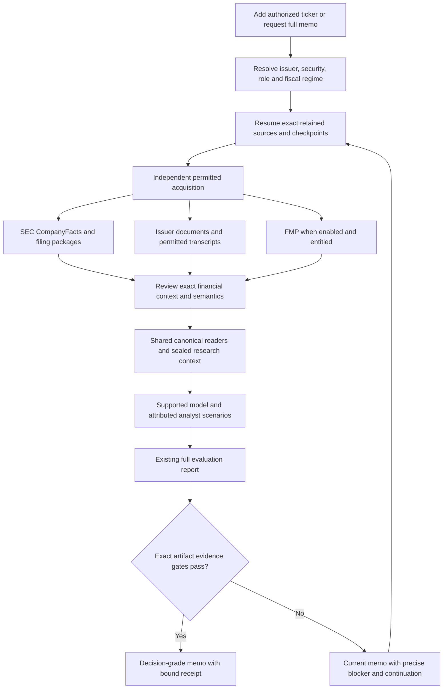

# New-ticker onboarding and decision-grade memo review

Review date: October 4, 2026. Status: implemented locally; release and live
qualification pending. This review uses the MBGL capture/delivery receipts,
current executable paths, owning data policies, and isolated regression evidence.
It is not a production-readiness certificate.

The recurring defect was a disconnected workflow. Adding a ticker invoked older
FMP-oriented onboarding. SEC capture, native extraction, semantic admission,
financial reading, model qualification and memo delivery had separate paths.
Several paths assumed an existing company, existing admitted facts, and an
owner-configured model. Instructions did not close those executable gaps.
These defects affect other newly added tickers. Registration history, carve-out
scope and YTD cash flows made more of them visible for MBGL.

## Intended outcome and authority

Adding an authorized ticker starts permitted source acquisition. A request for a
full memo resumes that work, fills available evidence, uses the existing report
family, and retains the exact artifact with its readiness receipt. FMP access and
owner-thesis confirmation are separate from primary-source acquisition and an
analyst evaluation. A decision-grade label requires source authority, scoped
acquisition and extraction completeness, semantic admission, reader parity,
model evidence and reconstruction to pass.

The canonical Windows host remains the only production-state authority. This
work does not authorize trades, public disclosure, processor approval or an
uncoordinated release. Local changes are uncommitted and are not installed live.

## Causes and repairs

| Boundary | Shared cause | Local repair and limit |
| --- | --- | --- |
| Procedure discovery | The installed investing skill pointed to a deleted worktree. | The preceding phase restored the maintained skill link. Referenced-source review remains an explicit gate. |
| New issuer identity | Static CIK-map membership excluded newly registered names. | Active issuer/CIK authority now selects CompanyFacts and quarterly SEC work. Exact SEC registry, submissions and inline security evidence can establish supported equity/ADR identity. Conflicts and unknown securities fail before HTTP. |
| Tracking handoff | The detached onboarding child lacked explicit state/database selectors. | Code, retained state and database remain separate. The child receives the approved selectors. |
| Provider continuation | FMP failure, disabled access, budget and IPO backoff could stop SEC. | SEC acquisition is independent. Those controls affect FMP only; an explicit SEC skip remains available. |
| Optional model work | Acquisition-only mode skipped transcripts and IR documents. Hidden report helpers could call models. | `--skip-llm` keeps source collection, passes transcript `--skip-extract`, and suppresses commitment/Say-Do/IR-summary model work. Optional report model calls require their existing opt-in. |
| State authority | Entrypoints inferred `state/data/portfolio.db` or used stale process state. Child adapters retargeted only some paths. | Onboarding, pending and service startup require approved database configuration. Child caches, immutable bytes, receipts and cost accounting receive the selected state/database. No checkout database is created. |
| Pending selection | Missing owner-conditioned DCF inputs repeatedly queued the heavy source chain. | Source onboarding and analysis readiness are separate. Absent owner inputs do not imply repeated source work or approval. |
| Registration history | `10-12B` and amendments were inventory-only. | Exact `10-12B` and `10-12B/A` enter financial-package capture with their actual form and SEC duty. They remain outside periodic reporting anchors. Other registration forms are not implicitly supported. |
| CompanyFacts coverage | The legacy parser skipped YTD durations. Its exact matches did not create v2 semantic cells. | A typed continuation validates accepted matches or exact retained raw entries, entry hashes and same-issuer filing context. It appends immutable observations, reviewed definitions, bindings and resolutions. Annual/YTD spans are preserved. Rows alone do not prove complete statements. |
| Financial semantics | Empty dimensions could be read as consolidated; definition changes and extensions lacked an exact review boundary. | Source-bound reviews establish entity, fiscal span, basis, scope and native concept role. Combined carve-out observations retain their scope. Unknown definitions, arbitrary dimensions and wrong standard roles fail closed. |
| Native installation | The tracked bundle is a template; candidate lookup required manually finding four paths. | One typed installation descriptor and read-only preflight report missing/template/unapproved/drifted/unqualified states. No candidate or approval is inferred. |
| XBRL units | Local unit IDs were used as semantic units. | Canonical numerator/denominator measures retain original unit IDs. Migration 0051 preserves v1 seals and admits the exact versioned v2 unit helper. |
| Financial readers | Native roles and carve-out scope were omitted or rejected. | Shared readers accept exact reviewed roles and expose scope in the existing source chip. Annual/quarter tables retain their cadence; YTD operands are available to the model without a false quarterly label. A dedicated YTD table remains unsupported. |
| Valuation | Verified recipes effectively covered MELI only. | `operating_cashflow_equity.v1` supports bounded domestic nonfinancial US-GAAP/USD companies. It uses admitted CFO, cash capex, SBC, cash, debt and shares with reviewed assumptions. Banks, funds and unsupported foreign/reporting regimes still need their own method. |
| Scenario qualification | Readiness always appended `scenario_acceptance_unverified`; no analyst evidence could satisfy a memo. | A typed base/bear/bull analyst review binds exact inputs, source snapshot, probabilities, outputs and reviewer clocks. Memo-purpose readiness replays it. Default allocation readiness retains its approval blocker. |
| Model clocks | A new request file normally had an mtime after its embedded data cutoff. Calculation time was assigned from that cutoff. | Data cutoff, actual request capture and actual calculation clocks are separate. Fresh request files can qualify without backdating. Future metadata, quotes and calculation evidence fail. |
| Memo qualification | A generated HTML file or manifest could be treated as sufficient proof. | The verifier binds exact body/wrapper hashes, required rendered sections, every reader claim, sealed source membership, numerical display, calculations, raw bytes and model/source parity. Omitted claims and empty sections cannot qualify. |
| Calculation claims | The initial calculation population check found one occurrence but allowed extra numbers or a conflicting percent marker. It also rejected ordinary sentence punctuation after a number. | The exact numeric population now binds calculated values and separately verified reported operands. Extra dates, duplicates, wrong values and percent markers fail. A correctly punctuated calculation remains readable. |
| Existing model identity | MELI parent and child paths checked the recipe but could open a database or launch a child before rejecting another ticker's evidence. | Both paths validate the nested evidence ticker before those effects. Exact refusal codes, no output mutation and no database-path access are tested. |
| Recovery | Stages had unrelated selectors and weak child-success checks. | The requested-memo coordinator retains typed stage receipts, exact returned artifact identity, bounded progress-based capture resumption, exact document review filters and immutable request commitments. Invalid or unchanged failed stages stop. |
| Local verification inventory | Pyright analyzed new unstaged modules while the full quality gate counted only tracked files. | The retained inventory now includes exact Git-discovered non-ignored new Python paths. Ignored and excluded files stay outside the population. Exact file counts, path validation and descending error/suppression ceilings remain required. The shared index is unchanged. The measured cleanup lowered diagnostics by 306 and suppression counts by 74 against the preceding working ceilings. |

Package scope is `governed-reporting-package-scope@6`. Document processing uses
`complete_reporting_document_processing` version 2 and
`document-processing-terminal-at-k-observed-through-o.v2`. Research snapshot
selection remains `research-snapshot-terminal-at-k-observed-through-o.v1`.
The SEC `regulator_inventory` duty and publisher duty remain distinct.

## Supported operator flow

Use the managed `execution/sqlite_bootstrap.py` launcher for operational CLIs.
`execution/prepare_decision_brief.py --ticker T --repo-root <retained-state>
--db <approved-database>` returns a read-only plan. `--apply` executes the
authorized source/report work. `--skip-fmp` preserves SEC acquisition.
`--enable-llm` explicitly enables optional model work.

Source-context reviews, model requests and full claim reviews are typed inputs.
The coordinator does not invent their contents, approve source meaning, or
silently run whole-book population to manufacture a missing seal. The investing
workflow owns preparation of these inputs and issuer-scoped seal continuation.
`execution/verify_decision_brief.py --inspect-body` returns the exact retained
claim population. Its review must cover every block. Exact source wording,
admitted values and supported calculations have deterministic reconstruction.
Free-form paraphrase semantics and analyst judgment still require review.

An analyst scenario receipt can qualify the supported model for a memo. It
cannot supply owner scenario acceptance, thesis approval or allocation authority.

## MBGL state and remaining blockers

The preceding live phase retained 69 legacy financial facts and immutable
observations with exact-match evidence, and a complete scoped capture receipt for
112 expected documents across four reporting packages. That scope did not include
registration financial packages under the newly implemented policy. These counts
do not establish complete financial statements or v2 semantic admission.

The saved full MBGL analyst memo is
`report_MBGL_2026-10-04_e1931503094da91f6946`. Its prior degraded status remains
unchanged. This phase did not change production financial state or certify it.

| Remaining boundary | Evidence and next required action |
| --- | --- |
| Windows native processor | DLL initialization and lifecycle qualification failed. A synthetic job unexpectedly contained a second unidentified process. Failed receipts remain failed. Repair the cause and prove exact child/handle containment, network/write denial and native extraction before approving a rebuilt bundle. Current test resources have been removed after independent absence/hash checks. |
| Coordinated release | The previous maintenance latch was removed and services restored. A separate owner controls the combined release window. These changes await source-write/release handoff and installation. No main merge or live mutation was performed here. |
| Actual MBGL admission | Run the released registration intake and source-context continuation against exact retained MBGL disclosures. Prove carve-out versus standalone comparability, fiscal spans, current completeness and shared-reader results. The current live v2 projection remains unqualified. |
| Actual model and memo review | Produce the source-bound supported recipe, attributed scenarios and exact full reader claim review. An owner thesis is not required for this analyst memo. Native/source and model gates cannot be cleared by a narrative valuation. |
| Whole workflow qualification | Component and adversarial tests do not prove a positive real source-to-sealed-research-snapshot-to-full-memo certification. That integration qualification and installed user-path verification remain required. |
| Local release gates | Reachability and procedure closure passed in the fully indexed isolated candidate. The complete candidate run then passed 17,826 tests, skipped 67, and failed four cases. Two early MELI issuer checks were corrected; the transcript fixture now uses selected state, and the migration test uses the approved shared fixture. Their targeted checks pass. Successor calculation/source changes require renewed final source commitments and the final release gate; the failed full run remains failed. |
| Source limits and method bounds | Undisclosed facts remain missing. Dedicated YTD table display and unsupported sector/foreign recipes remain explicit limits. No universal all-ticker decision-grade claim is made. |

## Verification record

The evidence is grouped by boundary. Counts overlap and must not be added.

- Source/admission/recipe worker: 188 tests passed before final incremental guards;
  30 final continuation/vector cases passed. Those fixtures use real financial
  publication and semantic authorities; some model tests isolate source coverage.
- Native installation/unit protocol: 197 tests passed, with three Windows-only
  skips on Mac; final migration cohort passed 16 tests. This does not qualify the
  Windows native sandbox.
- Registration policy/intake: 136 tests passed, including both native CLI synthetic
  form captures and separate SEC/publisher duties. Six regressions failed first.
- Acquisition repair: 84 tests passed. Onboarding authority repair: 79 tests
  passed. Existing shadow databases and stale bindings cannot supply authority.
- Memo/runtime/renderer cohort: 265 tests passed with one Windows junction skip
  before final scenario/authority changes. Golden tests ran in comparison mode.
  No golden expectations were regenerated.
- Final root authority/memo cohort: 95 tests passed before final display/path
  refinements. Exact source-chip before/after captures at 1440 and 1024 pixels
  retain the existing layout and add the carve-out scope label.
- Latest combined changed-file run: 1,173 passed, three Windows-only skips and
  one failed reachability closure test. Architecture, formatting, lint, changed
  strict types and inline-suppression checks passed for 141 retained files.
- Retained-inventory repair: its regression failed first because Pyright counted
  two files while the gate counted one. The final static-quality/inventory cohort
  passed 41 tests. Ruff and strict Pyright passed on both changed owners.
  The shared checkout contains exactly 31 new retained Python files plus the
  excluded migration. Their paths, sizes and hashes are recorded in the handoff.
- Final static gate: architecture, formatting, lint, strict changed-file types
  and suppression checks passed for 143 retained files. The whole-tree ratchet
  passed its exact 2,687-file census after the measured ceiling reductions.
  This is a descending-debt gate; it does not assert a zero-error whole tree.
- Design synchronization and all 11 reconstruction subsystem checks passed.
  Golden checks ran in comparison mode. Source-chip views were reviewed at both
  widths after the open transition completed. No test listener remained.
- The final complete test matrix has not passed for these exact combined bytes.
  A separate release candidate is under verification. Its result must not be
  substituted for this checkout without exact source identity.
- Subsequent combined candidate matrix: 17,826 passed, 67 skipped and four
  failures. The failure receipts are retained. The successor memo/migration
  cohort passed 92 tests; the issuer/transcript/cash-flow cohort passed 58.
  The final memo/coordinator cohort passed 70 tests. These counts overlap.
- Three calculation population cases were reproduced at the actual boundary
  before the fix. The regression cohort also found the sentence-punctuation
  rejection. Successor guards close both cases without certifying free-form
  paraphrase meaning or unsupported rendered metadata.

Final combined check results and reviewed-source handoff are retained under
`.tmp/new-ticker-decision-grade-2026-10-04/`. The complete applicable local gate
must pass before release; prior component successes do not override a later
failure or missing live evidence.

Primary changed owners: `execution/onboard_ticker.py`, the pending/state adapters,
`src/pipeline/sec_onboarding_identity.py`, SEC inventory/capture policy,
`src/provenance/financial_statement_admission.py`, CompanyFacts continuation,
native installation/unit protocol, `src/dcf/cashflow_*`,
`src/research/decision_brief*`, `src/research/memo_claim_support.py`, report
artifact/financial readers, source chips, operating procedures and reconstruction
inventory. Existing report format and production approval boundaries remain.
