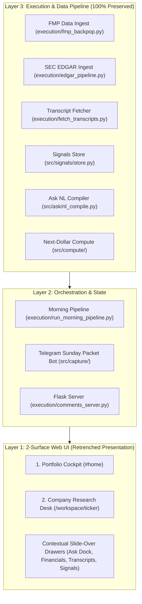

# Stranded Modules & Backend Preservation Policy

This policy document specifies how python modules, database schemas, CLI entrypoints, and background services are preserved following the front-end retrenchment into the 2-Surface Unified Cockpit model.

---

## 1. Governance Rule: Zero Backend Code Loss

Per the repository's 3-Layer Architecture (`AGENTS.md`):
- **Deterministic Python logic (`src/` and `execution/`) must NEVER be deleted** simply because a web surface was simplified.
- Front-end retrenchment affects the **presentation layer only**.
- 100% of underlying pipeline primitives, database tables (Alembic migrations), LLM call purpose handlers, and CLI entrypoints are **preserved as active services**.

---

## 2. Inventory of Impacted UI Modules & Backend Preservation Mapping

| Impacted / Stranded Web Surface | File Location | Retrenchment Action in Web UI | Backend Preservation Mapping & Service Surface |
|---|---|---|---|
| **Ask Engine Page (`#explore`)** | `src/pipeline/explore_panel.py`, `src/ask/` | Demoted top-nav tab. | **100% PRESERVED**. Natural Language ViewSpec Compiler (`src/ask/nl_compile.py`), grounding (`src/ask/grounding.py`), and series resolver service the `Ask Copilot Side Dock` and `data-fact-ref` click handles. |
| **Information Diet Panel** | `src/pipeline/diet_panel.py`, `src/signals/` | Merged into company workspaces. | **100% PRESERVED**. The `signals` table (alembic 0095) and non-decaying ingest store (`src/signals/store.py`) continue pulling IR drops, rating upgrades, and news feeds, serving each stock's `Updates & Signals` tab. |
| **Review Panels (`musings`, `triage`, `journal`)** | `src/pipeline/musings_panel.py`, `triage_panel.py` | Re-parented into Home Cockpit & Telegram bot. | **100% PRESERVED**. Telegram push packet builder (`directives/navigation_ia.md`), `analyst_notes` store, decision outcome grader, and `triage` queue remain active. |
| **Portfolio Synthesis Consoles** | `src/pipeline/portfolio_console_panel.py` | Re-parented into Home Cockpit Hero. | **100% PRESERVED**. Governed Next-Dollar allocation engine (`next_dollar_model.py`), risk budget calculator, and restatement detection stay active as core compute primitives. |
| **Command Center Shell Router** | `src/pipeline/command_center_shell.py` | Retrenched top-nav tabs (2 handles). | **100% PRESERVED**. Redirect aliases (`_LEGACY_PANEL_REDIRECTS`) maintain backward compatibility so deep links (e.g. `#explore`, `#portfolio`, `#review`) resolve smoothly. |

---

## 3. Data Flow Architecture Post-Retrenchment

---

## 4. Summary

- **Zero Data Loss**: No database fields or tables are excised.
- **Zero Script Deletion**: All CLI tools under `execution/` and compute engines under `src/` remain fully functional.
- **Clean UI**: The web front-end gains maximum clarity and speed while leveraging the full richness of the backend platform.
