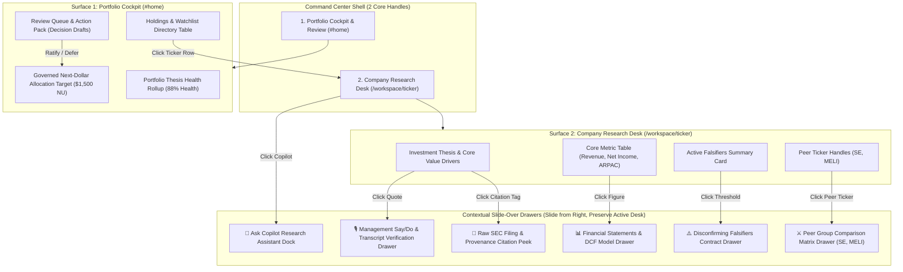

# 2-Surface Unified Portfolio Cockpit Architecture Diagram

This document outlines the retrenched **2-Surface Unified Portfolio Cockpit Architecture** for the equity research platform based on collapsing Today, Portfolio, and Review into ONE unified home cockpit.

---

## 1. The 2 Core Surfaces

1. **Surface 1: Portfolio Cockpit & Review (`#home` / `/`)**:
   - **Hero Band**: Portfolio Thesis Health (88% Health, +32.4% 1Y Return), Risk Budget, and Governed Next-Dollar Allocation Target (`NU - $1,500`).
   - **Review Queue Band**: Pending Decision Drafts (Ratify/Defer), Missing Falsifier Alerts, Reconcile Queue.
   - **Holdings & Watchlist Directory**: Active portfolio positions & watchlist equities with conviction pills, target prices, and 1Y returns. Clicking any row opens its Company Workspace.

2. **Surface 2: Company Research Workspace (`/workspace/{ticker}`)**:
   - High-density single-page editorial research desk for any ticker (`NU`, `BKNG`, `TSM`).
   - All supporting modules open as **Slide-Over Drawers**:
     - 📊 **Financial Statements & DCF Model Drawer**
     - 🎙️ **Management Say/Do & Transcripts Drawer**
     - ⚔️ **Peer Comparison Matrix Drawer**
     - ⚠️ **Disconfirming Falsifiers Contract Drawer**
     - 📜 **Raw SEC Filing Citation Drawer**
     - 💬 **Ask Copilot Side Dock**

---

## 2. 2-Surface Architecture Topology

---

## 3. Retrenchment Summary

| Former View | Retrenchment & New Home |
|---|---|
| **Today Page** | **COLLAPSED into Home Cockpit**: Open loops sit directly below Portfolio Health on `#home`. |
| **Portfolio Page** | **PROMOTED to Home Cockpit**: Portfolio Health & Governed Next-Dollar allocation target become the main hero of the app. |
| **Companies Page** | **EMBEDDED into Home Cockpit**: Active holdings and watchlist live directly on `#home` below the Review Queue. |
| **Review Page** | **EMBEDDED into Home Cockpit**: Synchronized with Telegram Sunday Packet; ratifications execute directly on `#home`. |
| **Ask Engine** | **DEMOTED to Slide Dock**: Slides out from right edge on demand (`Ask Copilot 💬`). |
